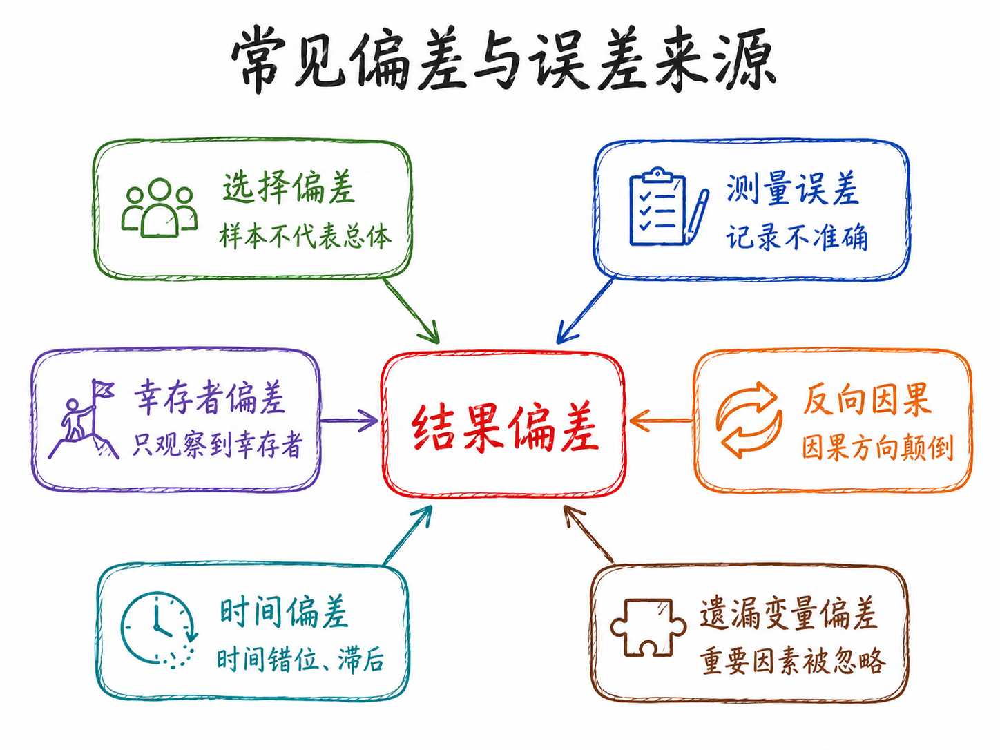
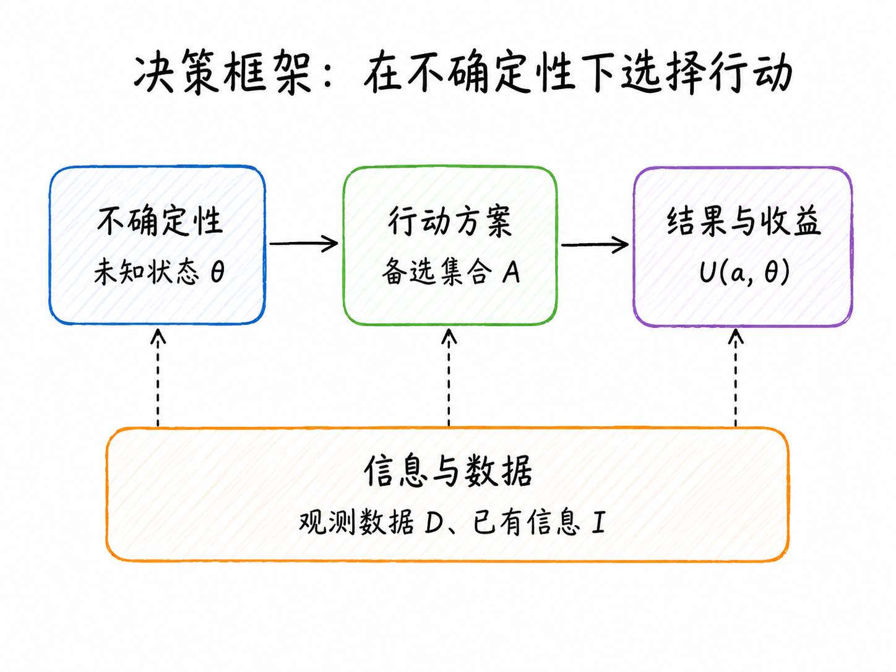
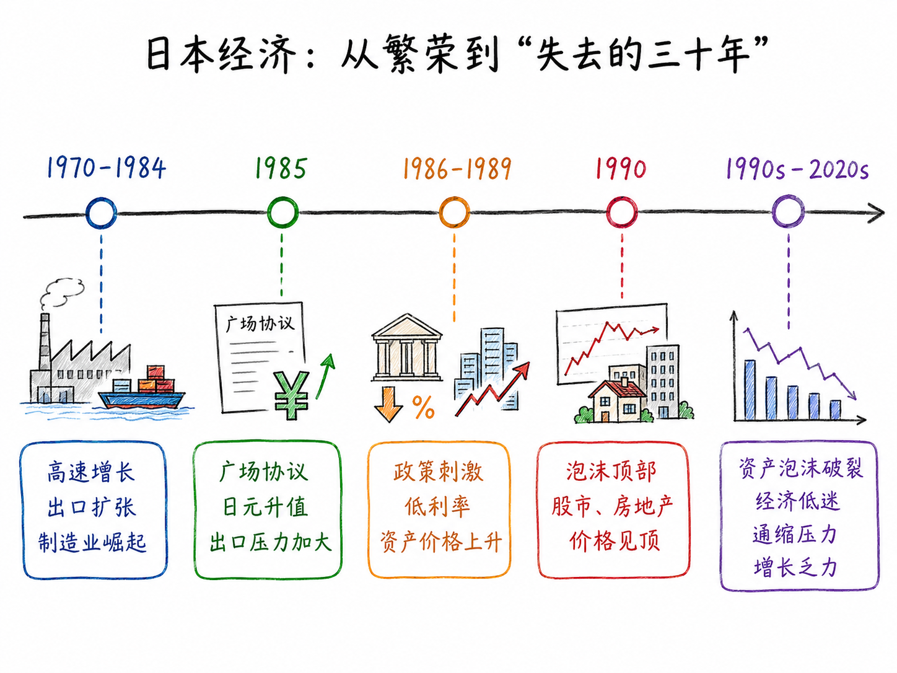
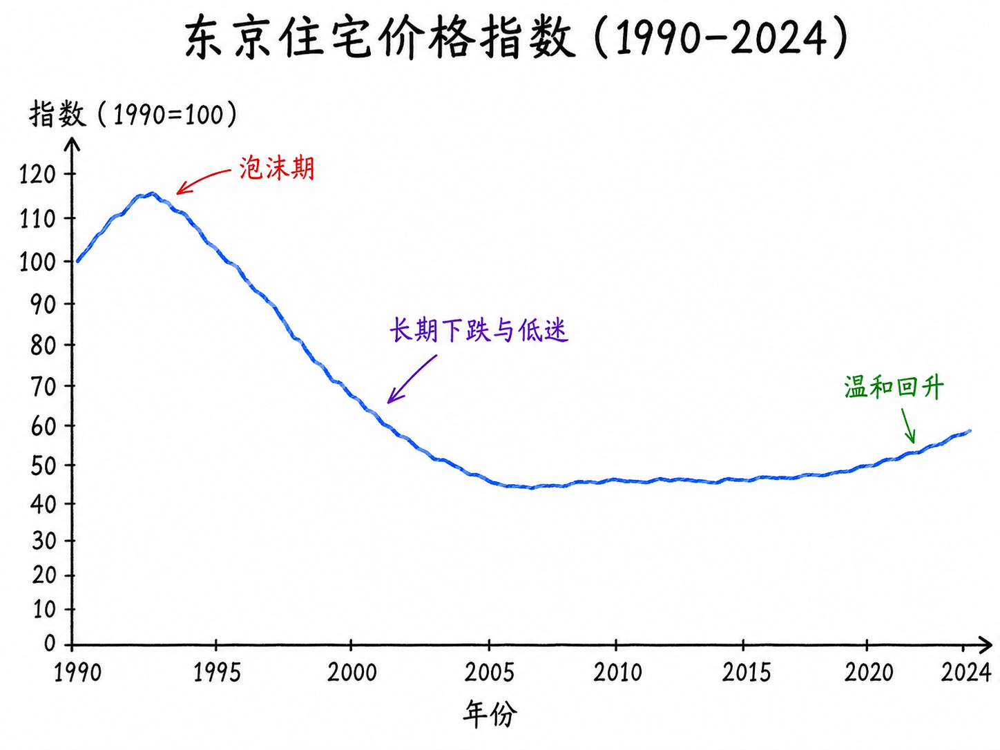
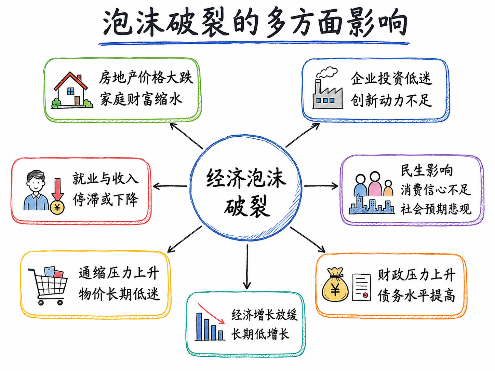

---

> **本章核心问题**：数据分析是什么？它的本质是什么？通过三个案例，理解"好的分析"需要回答哪三个关键问题。

---

## 导言

你在职业生涯中，一定做过一些重要决策：要不要跳槽、公司该不该上这个项目、某项政策要不要推行……请认真想一想：**你有没有系统性地收集过数据来支撑这些决策？**

大多数人的诚实答案是：没有，或者只是象征性地找了几个数字。我们的决策主要靠直觉、经验，或者"感觉差不多"。

这门课想做一件事：**在直觉和经验之上，建立一套用数据辅助决策的思维框架和操作能力。**

这件事的难点不在于技术，而在于习惯和思维方式。技术是可以学的，思维方式的改变需要更长时间。所以这一讲，我们先不谈工具，只谈"数据分析究竟是什么、它能帮我们做什么、做不到什么"。

---

## 什么是数据分析？

### 目标永远是第一位的

做数据分析，最常见的错误不是方法选错了，而是**问题没问清楚**。

分析者拿到数据，急于建模、跑回归、出图表，最后得到一堆结果，却发现它们回答不了决策者真正关心的问题。

**目标决定数据，数据决定方法，方法服务于结论。** 离开目标谈分析，就像没有目的地的导航——走得越快，越容易偏离。

数据分析之前，至少要问清楚四个问题：

- 谁在做决策？
- 他面对哪些行动选项？
- 他希望最大化或最小化什么？
- 做错决策的代价是什么？

同样一组房价数据，买房者、银行、政府、中介关注的问题完全不同，需要的分析也截然不同。这四个问题决定了后续的数据收集、变量选择、模型设定和结论解释。

数据分析的目标，大体可以归为四类：

| 目标类型 | 核心问题 | 例子 | 常用方法 |
|----------|----------|------|---------|
| **描述** (Describe) | 发生了什么？ | 某城市房价过去三年如何变化？ | 汇总统计、可视化 |
| **解释/因果** (Explain) | 为什么发生？ | 降低利率是否推高了房价？ | RCT、DID、IV、RDD |
| **预测** (Predict) | 未来会怎样？ | 明年房价继续下跌的概率有多大？ | 时间序列、机器学习 |
| **决策/评价** (Evaluate) | 某干预有效吗？ | 刑责年龄政策是否减少了犯罪？ | 成本收益、政策评价 |

这四类目标对应不同的分析逻辑，**不能相互替代**。知道房价在下跌，是描述；预测未来走势，是预测；判断某政策是否导致了下跌，是因果分析；决定自己是否应该买房，是决策问题——常见的错误，正是把这四类问题混在一起。

::: {.callout-note}
**探索性分析也是合法目标**

"目标第一位"有一个重要例外：**探索性数据分析（EDA）**。有时候你并不预设问题，而是通过浏览和可视化数据来*发现*值得追问的问题——数据本身会"开口说话"，告诉你哪里有异常、哪里有规律。

真实的分析工作，往往是"目标引导分析"和"数据启发目标"的来回迭代，而不是单向线性的流程。
:::

### 数据不是事实本身

在进入方法论讨论之前，有一点必须先说清楚：**数据不等于事实本身。**

数据是事实在某种制度、平台、工具或组织流程下留下的**记录**。理解数据，必须理解数据是如何生成的。举几个例子：

- 房产平台上的**挂牌价**，不等于真实成交价
- 电商**评论**，不等于所有消费者的真实评价——沉默的大多数不发声
- **问卷数据**只反映受访者愿意回答、能够回答以及被问到的问题
- **股票价格**来自市场交易，但财务报表来自会计制度，两者口径不同
- **企业数据库**通常只包括已进入系统的客户，不包括从未接触企业的潜在客户

可以把观测数据理解为真实世界经过一系列规则过滤之后的结果：

$$
D = g(W,\ R,\ M,\ S)
$$

其中，$D$ 是观测数据，$W$ 是真实世界，$R$ 是记录规则，$M$ 是测量方式，$S$ 是样本选择机制。

这意味着，数据分析不能只问"有没有数据"，还要问：这些数据是谁记录的？哪些对象被纳入，哪些被排除？变量的定义是否稳定？是否存在系统性遗漏或选择性报告？

**如果忽视数据生成机制，后续模型越复杂，误导性可能越强。**

### 本质一（方法论）：用不完美的数据逼近真实规律

数据分析的第一个本质，是一个认识论层面的挑战：**我们拥有的数据几乎永远是不完美的，但必须从中推断出尽量可靠的结论。**

现实数据的不完美体现在多个维度：有限性（只有部分样本）、残缺性（缺失值和测量误差）、有偏性（样本不代表总体）、内生性（解释变量与被解释变量相互影响）。

统计推断的核心承诺：**我不知道确切答案，但我可以给你一个估计值，并且告诉你我有多不确定**。置信区间、标准误、p 值，都是在量化这种不确定性。

了解常见偏误来源，是做好数据分析的基础：



这些偏误往往无法通过更复杂的模型自动消除——很多时候需要回到数据生成机制本身，从源头识别问题。

### 本质二（功能）：为决策者减少不确定性

数据分析的第二个本质，是关于它的**价值定位**：通过收集和处理信息，降低决策者面临的不确定性，从而改善决策质量。

不确定性至少有两类：

- **事实不确定性**：我不清楚当前真实情况是什么（例：同小区真实成交价是多少？）
- **结果不确定性**：我不知道采取某个行动之后未来会发生什么（例：现在买房，明年价格会继续跌吗？）

一个简洁的决策框架：

$$
a^* = \arg\max_{a \in \mathcal{A}}\ \mathbb{E}\bigl[U(a,\,\theta) \mid D,\, I\bigr]
$$

其中，$a$ 是可选行动，$\theta$ 是未知状态，$D$ 是数据，$I$ 是已有信息，$U(a,\theta)$ 是在状态 $\theta$ 下采取行动 $a$ 的收益。数据分析通过提供更好的 $D$，帮助决策者缩窄对 $\theta$ 的不确定范围，从而改善 $a^*$ 的质量。



::: {.callout-important}
**不确定性 ≠ 信息不对称，请注意区分**

- **不确定性（Uncertainty）**：我自己对某事不够确定——*一个主体内部*的问题。
- **信息不对称（Information Asymmetry）**：我和另一方之间存在信息差——*两个主体之间*的问题（Akerlof，1970：二手车市场的逆向选择）。

信息不对称是不确定性在*经济博弈语境*下的特殊形式，是经济学中独特且重要的分析框架。但数据分析的价值远不止于此，它覆盖所有需要从数据中提取信息以支持决策的场景，无论是否涉及多方博弈。
:::

### 数据分析的结论必须有边界

好的数据分析不给出脱离条件的绝对结论。同样是分析 2026 年买房问题，以下两种结论的质量截然不同：

> ❌ **口号式**：2026 年不适合买房。

> ✅ **有边界的**：在居民收入预期偏弱、二手房挂牌量较高、成交周期较长、租售比较低且家庭居住需求并不迫切的条件下，2026 年对投资型购房者可能不是理想入场时点；但对于现金流稳定、长期自住、能够获得明显折价且交易成本可控的购房者，结论可能不同。

任何数据分析结论，都至少要说明三件事：数据**支持**了什么；结论**依赖**哪些假设；结论**不能外推**到哪里。可以把它概括为：

$$
\text{结论} = f(\text{数据},\ \text{假设},\ \text{方法},\ \text{情境})
$$

这也解释了为什么同一组数据，不同研究者可能得出不同判断——差异不一定来自谁"不懂数据"，更可能来自分析目标、假设、样本选择和风险权重的差异。**分析框架本身是有立场的**，好的分析者会把这些立场显性化，而不是把它们藏在"客观分析"的外衣下。

### 数据决策 vs. 直觉决策：一个简例

**2021 蒙特卡洛大师赛，八强赛：卢布列夫 vs. 纳达尔**

纳达尔在红土赛场几乎不可战胜，但卢布列夫的团队在赛前做了一件事：**系统分析纳达尔历史比赛中的落点热力图和移动重心数据**。他们发现：纳达尔习惯性地在某种情境下预判对角线来球，重心会提前偏向那一侧——此时沿直线打回马枪，得分概率显著提高。

战术实施：先持续攻击纳达尔的反拍侧，强化其预判习惯，然后在关键球上突然变线。


核心信息只有一句：**基于数据的战术分析，帮助球员做出了单凭经验和直觉无法做出的决策。** 它同时提示了一个博弈维度——**对手也在分析你**。金融市场中同样如此：你的交易行为构成数据，对手方也在分析这些数据并据此调整策略，这正是量化交易和算法博弈的底层逻辑。

---

## 三个案例：好的分析需要回答哪三个问题

单凭直觉做决策，通常在三个维度上犯错：

| 失败模式 | 表现 | 对应案例 |
|---------|------|---------|
| **目标设错了** | 在优化一个错误的指标，或遗漏了重要利益相关方 | 刑责年龄 |
| **效果算不全** | 只看到直接效果，忽视了间接效果和外部性 | 肯尼亚驱虫药 |
| **时间维度短** | 短期数据和长期规律截然相反 | 日本三十年 |

::: {.callout-tip}
**阅读指引**

每个案例都有两条线：一条是**事件本身**（政策背景、数据发现、历史经过），另一条是**方法论启示**（这个案例告诉我们分析时应该注意什么）。案例可以忘，方法论启示要带走。
:::

### 刑责年龄——你在优化什么？

#### 背景

全球多个国家近年来重新审视**刑事责任年龄（Age of Criminal Responsibility）**。各国应对方向出现明显分歧：

- **降低**：日本（2000 年部分罪行从 16 岁降至 14 岁）；中国（2021 年对极端严重犯罪从 14 岁降至 12 岁，须最高检核准）
- **提高**：苏格兰（2021 年从 8 岁提高至 12 岁）；英格兰和威尔士讨论从 10 岁提高至 14 岁；多数北欧国家维持 15 岁，强调教育矫正

**同样面对"未成年人犯罪增加"这个事实，为什么有人降低年龄、有人提高年龄？答案不在数据本身，而在分析者在优化什么。**

#### 三类法律机制

| 机制 | 逻辑 | 短期效果 | 长期风险 |
|------|------|---------|---------|
| **威慑** | 处罚概率上升 → 潜在违法者减少犯罪 | 可能降低犯罪率 | 对未成年人效果有限（前额叶未发育成熟）|
| **失能** | 羁押 → 短期内无法继续作案 | 直接减少在押期间犯罪 | 不改变长期偏好 |
| **教育矫治** | 心理干预 + 社区矫正 → 降低再犯概率 | 威慑效果弱 | 长期人力资本效益高 |

#### 逐层展开目标框架

**第一层：只看当下这个案件** → 关注受害者，关注此时此刻 → 倾向降低刑责年龄

逻辑：犯了严重的罪，就应该承担后果，年龄不应是庇护的理由。这个直觉在情感上有强大说服力。

**第二层：看当事人的全生命周期**

数据说话：美国联邦司法统计局数据，在成人监狱服刑后获释的未成年人，5 年内再次被捕率约 60-70%；专业青少年矫正项目的类似人群，再犯率 25-35%。刑事案底还会永久影响就业、信贷和社会融入。结论开始动摇：刑事追诉可能不是减少了犯罪，而是把一个可能改变轨道的人推向了长期犯罪的通道。

**第三层：看社会总成本**

美国兰德公司（RAND）研究：一个高风险青少年罪犯的"终身社会成本"（含受害者损失、司法成本、监禁成本、税收损失）约为 160 万至 480 万美元。关入成人监狱 vs. 投入高质量教育矫正项目，哪个社会成本更低？在绝大多数情境下，后者更优。

**第四层：看代际效应**

父母入狱对子女有显著长期负面影响（经济压力、监护缺失、心理创伤），子女进入司法系统的概率显著上升——"**司法介入的代际传递**"。在这个框架下，将更多未成年人送入监狱的政策，可能通过代际效应在 15-20 年后**增加**社会犯罪成本。

#### 方法论启示

| 分析框架 | 关注谁 | 关注何时 | 倾向性结论 |
|---------|--------|---------|----------|
| 当下惩处 | 受害者 | 此时此刻 | 降低刑责年龄 |
| 全生命周期 | 当事人 | 终身 | 存疑或提高 |
| 社会总成本 | 全社会 | 中长期 | 投资矫正项目 |
| 代际效应 | 下一代 | 跨代 | 谨慎追诉 |

> **核心启示**：同一批数据，面对同一个社会现象，目标框架——谁的利益、什么时间跨度——不同，结论可以**完全相反**。数据分析之前，必须把"你在优化什么"这个问题想清楚。

---

### 肯尼亚驱虫药——你算完整了吗？

#### 实验背景

1998 年，经济学家 Michael Kremer 和 Edward Miguel 在肯尼亚西部布西亚地区对约 75 所小学开展了一项**随机对照试验（RCT）**：给学龄儿童定期发放驱虫药，成本约 0.5 美元/人/年。当地约 75% 的学龄儿童感染肠道寄生虫，影响营养吸收和认知发育。

#### 第一层：直接效果

感染率明显下降，腹痛和贫血症状减轻，课堂出勤率提高约 25%。如果分析到此为止，结论是：驱虫药有效，应该推广。大多数 NGO 报告会在这里收笔。

#### 第二层：外部性（真正精彩的地方）

Kremer 和 Miguel 发现了一个意外信号：**接受干预学校周边 6 公里范围内、未参与实验的学校，儿童的健康状况也有所改善。** 这些孩子没有拿到任何驱虫药，但他们变健康了。

原因：寄生虫通过粪口途径传播，当干预学校的感染率下降后，社区环境中的虫卵密度降低，保护了周边未接受干预的儿童。这是典型的**正外部性**：

$$
\text{政策效果} = \text{直接效果} + \text{溢出效果}
$$

如果评估只看直接受益者，就**系统性低估**了项目的真实价值。

#### 第三层：20 年后的追踪

2021 年，20 年追踪研究结果：幼年接受干预的儿童，成年后时薪比对照组高约 **14%**，工作时间更长，更多从事技能性就业，消费支出和储蓄率均更高。

因果链条：驱虫 → 改善营养与认知发育 → 提高课堂专注力 → 提高受教育年限 → 提升人力资本 → 20 年后更高劳动收入。每投入 1 美元，折现后的社会回报约为 **30 至 100 美元**。

#### 为什么市场没有自动解决？

三重市场失灵叠加，任何一重都足以导致驱虫药供给不足：

1. **信息不对称**：家长不知道驱虫药有如此高的长期回报
2. **正外部性导致私人供给不足**：私人收益 < 社会收益
3. **贫困陷阱**：健康差 → 学习差 → 贫困 → 没钱买药 → 健康差（自我强化闭环）

::: {.callout-note}
**帐篷 vs. 驱虫药**

很多 NGO 更愿意捐赠帐篷——可见、温暖、易于拍照。驱虫药是不起眼的白色小药片。但相同成本下，驱虫药的健康和教育产出远高于帐篷。

这种**可见性偏差（Visibility Bias）**——倾向于投资看得见效果的事物，忽视效果隐蔽但更高效的事物——在企业、政府和个人决策中无处不在。数据分析的一大价值，正是让这种"隐形的高回报"变得可见。
:::

> **核心启示**：不考虑外部性，几乎必然低估一项干预的真实价值。好的数据分析要主动问：**这件事的影响，是否波及了我目前没有测量的群体或渠道？**

2019 年，Michael Kremer 与 Abhijit Banerjee、Esther Duflo 共同获得诺贝尔经济学奖，表彰他们用 RCT 方法评估扶贫干预效果的系列研究。

---

### 日本失去的三十年——时间维度与动态复杂性

#### 时间线



**1970—1984 高速增长期**：制造业（汽车、电子、钢铁）全球竞争力达到顶峰，对美出口激增，GDP 年均增速 4-6%，人均 GDP 超过多数欧洲国家。

**1985 广场协议**：五国协议要求日元大幅升值。1985—1988 年间，日元兑美元从约 260 升至约 128，升值近 50%，出口竞争力急剧下降。**日本政府应对**：将利率从 5% 大幅降至 2.5% 并财政扩张。

**1986—1989 泡沫形成**：超低利率引发大规模资产价格上涨。日经 225 从约 13,000 点飙升至 1989 年底的 **38,916 点**（4 年涨 3 倍）；东京地价 5 年内上涨约 3 倍；银行以升值资产为抵押大量放贷，形成正反馈循环。

**关键问题**：在这个阶段，每一步决策在当时的数据下看起来都是"合理的"——这正是时间维度问题的核心：**局部合理的短期决策，可以累积成长期灾难。**

**1989—1990 主动刺破泡沫**：央行将基准利率从 2.5% 提升至 6%，限制房地产贷款。资产价格随即崩溃：日经指数跌超 60%，东京商业地产下跌约 70%，住宅价格下跌 40-60% 且持续 15 年。

#### 房价的长期演变



泡沫破裂后，东京住宅价格持续下跌直至 2005 年前后见底，累计跌去峰值约 60-65%。2013 年安倍经济学启动后开始温和回升，2020 年后受低利率和外资流入影响加速上涨，但 2024 年整体水平仍未完全恢复到 1990 年峰值。

#### 泡沫破裂的多方面影响



泡沫破裂的影响，远不止于房价本身，而是通过多个渠道向整个经济扩散：不良资产 → 银行惜贷 → 企业融资困难 → 就业下降 → 消费萎缩 → 通缩预期形成 → 需求进一步萎缩。这种**相互强化的负反馈循环**，是失去三十年难以终结的根本原因。

#### 为什么"十年"变成了"三十年"？

**资产负债表衰退（辜朝明）**：泡沫时期积累的巨额债务，在资产大幅缩水后仍然存在。面对负净资产，即使利率降至零，企业和家庭的第一优先级也是还债，而非借钱投资消费。传统货币政策（降息）因此失去效力——问题不是资金成本，而是**需求意愿本身崩塌了**。

**通缩预期的自我实现**：物价下跌 → 消费者推迟购买 → 需求萎缩 → 物价继续下跌。预期本身成为了必须测量和管理的变量。

**政策节奏的反复**：1997 年，在经济尚未充分复苏时上调消费税，直接中断了脆弱的复苏进程——单次决策的内部逻辑正确，但放在整个动态序列中，时机选择是错误的。

> **核心启示**：经济系统有复杂的反馈机制和长时间滞后。泡沫形成期的每一步看起来都合理，破裂初期的每一步刺激也看起来合理——但这些"局部合理"累积成了三十年的停滞。好的数据分析必须追问：**如果这个趋势持续 10 年，系统会走向哪里？反馈机制是放大还是稳定这个趋势？**

---

## 课堂讨论：2026 年，买房还是等等？

这是一个典型的开放性经济决策问题——没有标准答案，但不是没有分析框架。用前三个案例的方法论启示来结构这场讨论：

**问题一：你是谁，你在优化什么？**（刑责年龄案例的启示）

| 提问者 | 真实关切 | 核心分析变量 |
|--------|----------|-------------|
| 25 岁应届毕业生 | 买 vs. 租，月供可负担吗？ | 房价收入比、租售比、就业稳定性 |
| 改善型置换家庭 | 学区、居住品质、保值 | 区域供需、学区政策变化风险 |
| 投资型购房者 | 资本增值、租金回报 | 租售比、空置率、流动性风险 |
| 政策制定者 | 金融稳定、居住公平 | 系统性风险指标、住房可负担性 |

**问题二：你有没有算完整？**（肯尼亚案例的启示）

容易被忽视的"隐藏成本"：持有成本（物业费、维修、利息、机会成本）；流动性成本（房产变现需要时间和交易成本）；政策风险（房产税、限购、学区政策变动）；人口趋势（城市净流入/净流出）。

**问题三：你的时间维度是多少？**（日本案例的启示）

短期（1-3 年）和长期（10-20 年）的逻辑可能截然相反。中国有没有"日本化"的风险？值得长期追踪的指标：房价收入比、居民杠杆率、土地财政依赖度、通缩信号（PPI、CPI 分化）。

::: {.callout-tip}
**这个讨论引出后续课程的核心方法**

学完这门课，你至少可以把"感觉现在不是时候"替换成有依据的条件判断。这个问题涉及的分析方法将贯穿整个学期：

- 分析历史价格数据 → **时间序列分析**
- 比较不同城市或政策下的价格走势 → **面板数据与政策评价（DID）**
- 预测未来走势 → **预测建模与机器学习**
- 量化不确定性 → **置信区间与情景分析**
:::

---

## 本章小结

**五个关键认识：**

| 认识 | 核心内容 |
|------|---------|
| 目标第一位 | 先想清楚谁在决策、优化什么、约束是什么 |
| 数据 ≠ 事实 | 数据是经过记录规则、测量方式和样本选择过滤后的世界 |
| 方法论本质 | 从不完美数据提取可靠规律，并量化不确定性 |
| 功能本质 | 在有限信息下改善决策，而非消除所有不确定性 |
| 结论有边界 | 好的结论是有条件的、有假设的、有适用范围的 |

**三个案例的统一框架：**

| 案例 | 失败模式 | 核心追问 |
|------|---------|---------|
| 刑责年龄 | 目标设错了 | 谁的利益？什么时间跨度？ |
| 肯尼亚驱虫药 | 效果算不全 | 有没有考虑外部性和溢出？ |
| 日本三十年 | 时间维度太短 | 短期最优是否也是长期最优？ |

---

## 本讲作业

### 作业一：把开放问题转化为数据分析问题

从以下问题中选择一个（或自选类似的开放性经济决策问题）：

- 2026 年是否适合买房？
- 某只股票近期上涨是否有基本面支撑？
- 某个城市房价是否已接近底部？
- 某类职业的招聘需求是否在持续下降？

**要求：** 明确决策主体和行动选项；明确核心目标（优化什么）；列出至少 3 个关键变量和 2 个可能的数据来源；说明可能存在的数据偏误；给出初步分析思路。

### 作业二：AI 辅助分析日志

用 AI 辅助完成作业一，提交：

- 一条用于**问题拆解**的提示词及 AI 输出
- 一条让 AI 扮演**"反方审查员"** 检查分析漏洞的提示词及 AI 输出
- AI 输出中**至少一处错误或不足**的识别与人工修正说明

### 作业三：数据说明表

选择一个与你分析问题相关的数据集，填写以下说明表：

```markdown
## 数据说明表

- 数据名称：
- 数据来源（网址）：
- 获取方式：（手动下载 / API / 爬虫）
- 样本范围：
- 时间区间：
- 观测单位：
- 核心变量：
- 数据频率：
- 缺失值情况：
- 可能的数据偏误：
- 使用限制或版权说明：
```

::: {.callout-note}
**每次作业提交须附 AI 使用说明**

```markdown
## AI 使用说明

- 使用工具：
- 使用环节：
- 关键提示词：（原文或链接）
- AI 输出的主要内容：
- 人工修改与核验内容：
- 仍可能存在的问题：
```
:::

---

## 延伸阅读

- Akerlof, G. A. (1970). The market for "lemons". *Quarterly Journal of Economics*, 84(3), 488–500.
- Miguel, E., & Kremer, M. (2004). Worms. *Econometrica*, 72(1), 159–217.
- Kremer, M., et al. (2021). Twenty-year economic impacts of deworming. *PNAS*, 118(14).
- Koo, R. (2008). *The Holy Grail of Macroeconomics*. Wiley.
- Kahneman, D. (2011). *Thinking, Fast and Slow*. Farrar, Straus and Giroux.

---

*下一章：[数据分析与经济决策（下）：流程、数据、工具与 AI](ds_intro_02_setup.md)*
