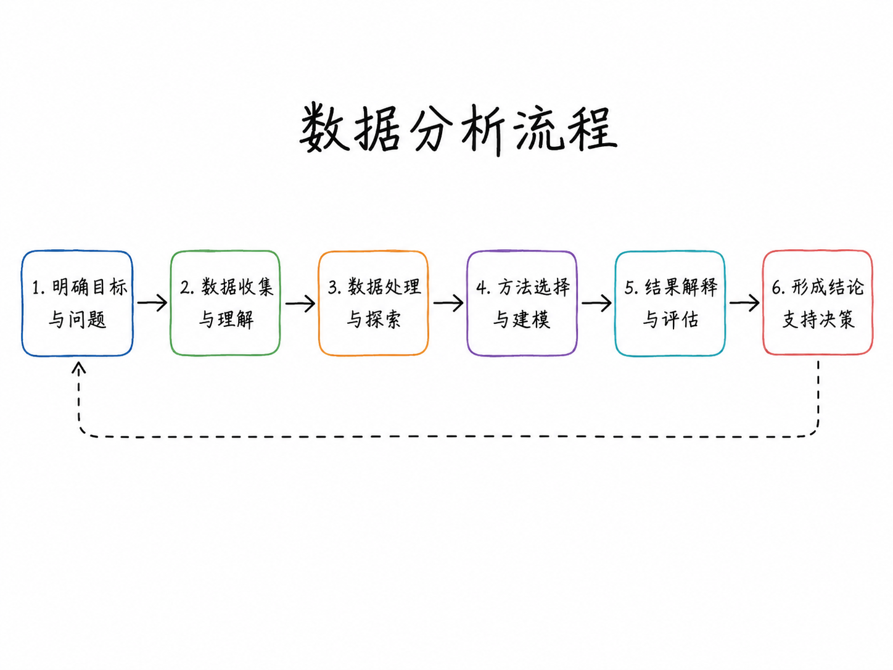
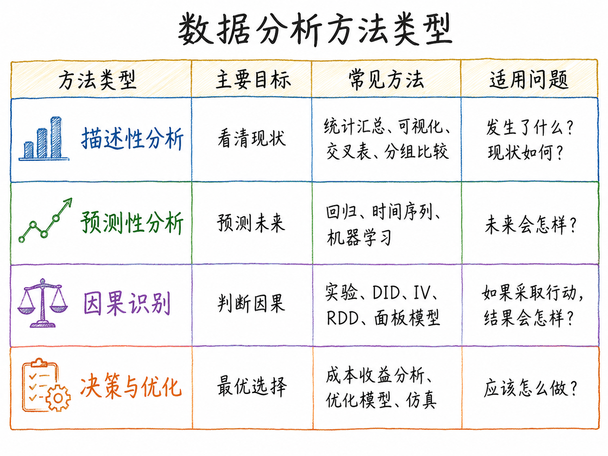
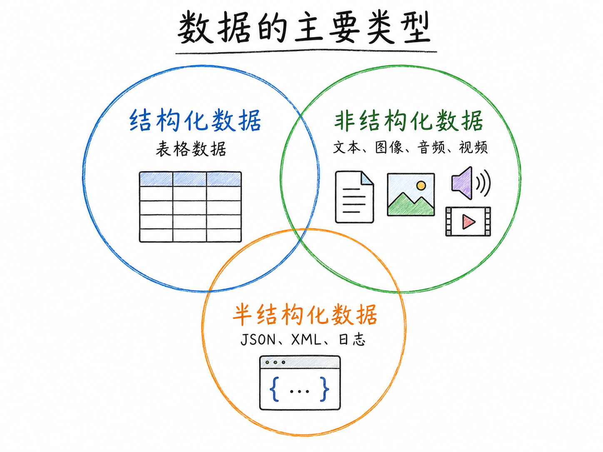
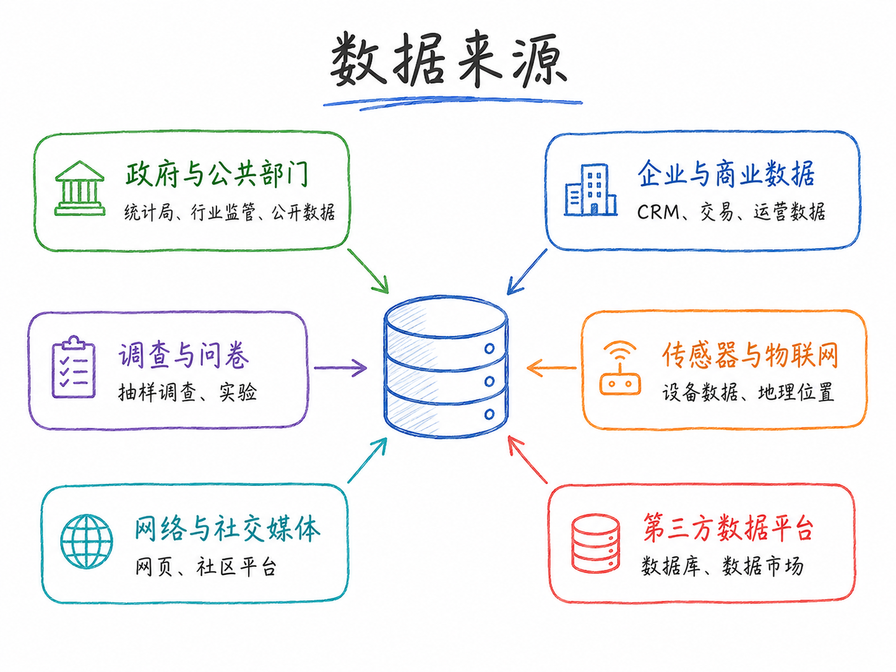

---

> **本章定位**：这不是一章需要精读的讲义，而是贯穿整个学期的**参考地图**。建议课上快速浏览，建立整体印象；遇到具体问题时再回来查阅对应章节和链接。

---

## 数据分析的基本流程

一个完整的数据分析项目，通常经历以下阶段。这张图既是本章的结构，也是整门课程的骨架——后续每一讲都对应其中的某个环节。



实际分析往往不是严格线性的，而是在"问题界定—数据获取—方法选择—结果解释"之间反复迭代。

| 阶段 | 核心任务 | 最常见的陷阱 | 对应课程内容 |
|------|----------|-------------|-------------|
| **问题定义** | 把模糊问题转化为可用数据回答的具体问题 | 跳过这步直接找数据 | 第一讲 |
| **数据获取** | API、爬虫、数据库、调查 | 不记录数据来源和版本 | 数据获取专讲 |
| **数据清洗** | 缺失值、异常值、格式、合并 | 低估所需时间（实际占 60-80%）| 数据清洗专讲 |
| **探索性分析** | 分布、相关性、异常、可视化 | 用 EDA 图表替代正式分析就收工 | 可视化专讲 |
| **建模分析** | 统计推断、因果识别、预测建模 | 选模型先于想问题 | 建模模块 |
| **结果解读** | 区分统计显著与经济显著；承认局限 | 只报 p<0.05，不报效应量 | 各建模讲均涉及 |
| **报告与沟通** | 可复现报告、可视化、叙事 | 结论对受众不可理解 | Quarto 专讲 |

四类分析目标对应的方法差异，可以参考下图：



::: {.callout-note}
**"80% 的时间在清洗数据"——认真的**

这不是夸张。真实项目中，数据获取和清洗加在一起，通常占整个分析时间的 60-80%。建模部分反而最快。接受这个现实，会让你在遇到脏数据时少一些挫败感，多一些耐心。
:::

---

## 数据类型与数据结构

### 按结构化程度



| 类型 | 特征 | 典型例子 | 主要分析工具 |
|------|------|----------|-------------|
| **结构化数据** | 行列格式，有明确字段定义 | 股价日数据、宏观指标、问卷数据 | pandas、Excel、SQL |
| **半结构化数据** | 有嵌套层级，但非规则表格 | JSON、XML、HTML、财报 XBRL | json、BeautifulSoup、lxml |
| **非结构化数据** | 无预定义格式 | 新闻文本、图片、音频、视频 | NLP 工具、CV 库、ASR 模型 |

本课程以结构化数据为主，兼顾文本（半/非结构化）。

### 按时间维度

| 类型 | 定义 | 例子 | 分析优势 |
|------|------|------|---------|
| **截面数据** | 某一时间点，多个个体 | 2024 年各省 GDP | 描述横截面差异 |
| **时间序列** | 同一个体，多个时间点 | 上证指数日收益率 | 刻画动态演化 |
| **面板数据** | 多个个体 × 多个时间点 | 31 省 × 20 年宏观数据 | 控制个体固定效应，增强因果识别 |

面板数据兼具截面和时序信息，是经济学实证研究中最常用的数据结构，也是本课程建模模块的重点。

### 按生成方式

这对区分**非常重要**，直接决定你能否做因果推断：

| 类型 | 定义 | 因果推断难度 | 例子 |
|------|------|-------------|------|
| **观测数据** | 自然发生，研究者不干预 | 高（存在混淆变量）| 企业财务数据、宏观统计 |
| **实验数据** | 研究者随机分配干预 | 低（随机化消除混淆）| 肯尼亚驱虫药 RCT |
| **准实验数据** | 利用外生冲击"模拟"随机化 | 中（需要论证外生性）| 广场协议作为汇率冲击 |

绝大多数经济数据是观测数据。因果推断的核心挑战，就是从观测数据中"还原"出类似实验的逻辑结构。

### 多模态数据（新兴方向）

**多模态（Multimodal）** 指同时结合多种数据类型的分析方法。随着大语言模型和多模态 AI 的发展，这个领域在金融和经济研究中正在快速扩张。

| 数据模态 | 金融/经济中的应用 | 典型来源 |
|----------|-----------------|---------|
| **文本** | 财报情感分析、货币政策声明解读、风险因素提取 | Wind、SEC EDGAR、Reuters |
| **图像** | 卫星遥感测算夜间灯光经济活动、港口船只数量 | NASA、Planet Labs |
| **表格 + 文本** | 财报 PDF（数字与文字混合） | 年报 PDF、招股书 |
| **音频/视频** | 分析师电话会议记录、CEO 声音语气与情绪识别 | Earnings call 录音 |
| **传感器/IoT** | 高频交易数据、供应链传感器数据 | 交易所 Level-2 数据 |

::: {.callout-note}
本课程不系统讲授多模态分析（超出课程范围），但有意识地了解它的存在很重要——它代表数据分析边界的扩展方向。文本分析作为最成熟的非结构化数据方法，在本课程中有专讲。
:::

---

## 数据来源与平台

### 数据来源的分类



常见数据来源包括：官方统计（国家统计局、央行）、行政记录（工商、税务、司法）、市场交易（股票、房地产、招聘）、平台行为（搜索、评论、社交媒体）、实验数据（RCT、A/B 测试）、文本数据（年报、公告、政策文本）、地理遥感数据（夜间灯光、卫星影像）。

不同来源各有优劣：官方统计权威但频率低、颗粒度粗；平台数据高频细颗粒但可能有样本选择问题；商业数据库整理程度高但成本高且有授权限制。

### 学术与商业数据库

| 数据库 | 覆盖范围 | 获取方式 |
|--------|----------|---------|
| [**Wind（万得）**](https://www.wind.com.cn) | 中国股票、债券、宏观、基金，最全面 | 高校/机构授权 |
| [**CSMAR（国泰安）**](https://www.gtarsc.com) | A 股上市公司财务、公司治理、IPO | 高校授权 |
| [**RESSET（锐思）**](http://www.resset.cn) | A 股数据，部分指标与 CSMAR 互补 | 高校授权 |
| [**WRDS**](https://wrds-www.wharton.upenn.edu) | Compustat（全球财务）、CRSP（美股）、TAQ（高频）| 高校授权 |

### 公开数据平台

| 平台 | 特点 | 链接 |
|------|------|------|
| **FRED**（美联储）| 美国及全球宏观，80 万+ 时间序列，有 Python API | [fred.stlouisfed.org](https://fred.stlouisfed.org) |
| **World Bank Open Data** | 全球发展指标，200+ 国家 | [data.worldbank.org](https://data.worldbank.org) |
| **IMF Data** | 国际货币基金组织经济统计 | [imf.org/en/Data](https://www.imf.org/en/Data) |
| **OECD Data Explorer** | 发达经济体宏观、产业、贸易、劳动数据 | [data-explorer.oecd.org](https://data-explorer.oecd.org) |
| **Our World in Data** | 社会、经济、健康、环境，高质量可视化，全部可下载 | [ourworldindata.org](https://ourworldindata.org) |
| **国家统计局** | 中国官方宏观统计 | [stats.gov.cn](http://www.stats.gov.cn) |
| **BIS Statistics** | 国际清算银行：银行、债务、房价、汇率 | [bis.org/statistics](https://www.bis.org/statistics/) |

### 数据科学平台

**Kaggle** — [kaggle.com](https://www.kaggle.com)

全球最大数据科学竞赛平台，托管 10 万+ 公开数据集，涵盖金融、医疗、社会科学等几乎所有领域。内置免费 GPU/TPU 计算环境和 Notebook，无需本地配置即可运行代码。数据、代码和讨论放在一起，适合学习完整的数据分析流程。**练手和找数据的首选**。

**OpenBB Terminal** — [openbb.co](https://openbb.co) | [GitHub](https://github.com/OpenBB-finance/OpenBBTerminal) ⭐ ~35k

开源金融数据终端，整合 50+ 数据源（股票、债券、加密货币、宏观经济、另类数据），支持 Python API，内置 AI Copilot。**金融分析的核心工具**。

```python
from openbb import obb
data = obb.equity.price.historical("600519.SS", start_date="2015-01-01")
gdp  = obb.economy.gdp(countries=["china", "japan", "united_states"])
```

**Hugging Face Datasets** — [huggingface.co/datasets](https://huggingface.co/datasets)

适合文本、图像、音频和多模态数据，尤其适合 NLP 和机器学习任务。

### API 直接获取

| 工具 | 覆盖范围 | 安装 |
|------|----------|------|
| [**yfinance**](https://github.com/ranaroussi/yfinance) | 全球股票、指数、ETF（Yahoo Finance）| `pip install yfinance` |
| [**akshare**](https://akshare.akfamily.xyz) | A 股、港股、期货、宏观，国内最全免费库 | `pip install akshare` |
| [**pandas-datareader**](https://pandas-datareader.readthedocs.io) | FRED、World Bank、OECD 等多源封装 | `pip install pandas-datareader` |

---

## 数据分析工具生态

### 编程语言的选择

| | Python | R | Stata |
|-|--------|---|-------|
| **定位** | 通用数据科学，AI 集成最佳 | 统计分析与可视化 | 计量经济学，学术研究 |
| **AI 集成** | 最好（Copilot、Agent 框架均以 Python 为核心）| 一般 | 弱 |
| **可复现性** | Jupyter/Quarto | R Markdown/Quarto | do 文件 |
| **本课程** | ✅ 主要语言 | 可选 | 可选 |

::: {.callout-tip}
已经熟悉 Stata 或 R 的同学，**不需要推倒重来**。本课程允许用任意语言提交作业。但建议逐渐向 Python 迁移——当你需要接入 AI 工具、处理非结构化数据或构建 Agent 时，Python 的生态优势是压倒性的。
:::

### 开发环境

| 工具 | 角色 | 链接 |
|------|------|------|
| [**VS Code**](https://code.visualstudio.com) | 主编辑器，支持多语言，AI 扩展丰富 | 免费 |
| [**Jupyter Notebook**](https://jupyter.org) | 交互式分析环境，代码 + 文字 + 图表三位一体 | 随 Anaconda 附带 |
| [**Quarto**](https://quarto.org) | 学术级可复现报告，支持多语言，输出 HTML/PDF/Slides | 免费，推荐 |
| [**Anaconda**](https://www.anaconda.com) | Python 发行版 + 包管理器 | 免费 |

### 核心 Python 分析库（概览）

| 类别 | 库 | 描述 |
|------|-----|------|
| 数据处理 | [pandas](https://pandas.pydata.org) | 数据框操作的事实标准 |
| 数值计算 | [numpy](https://numpy.org) | 高性能数组运算 |
| 静态可视化 | [matplotlib](https://matplotlib.org) / [seaborn](https://seaborn.pydata.org) | 图表绘制基础库 |
| 交互可视化 | [plotly](https://plotly.com/python/) | 动态图表，适合报告展示 |
| 统计建模 | [statsmodels](https://www.statsmodels.org) | OLS、时间序列、检验等 |
| 机器学习 | [scikit-learn](https://scikit-learn.org) | 分类、回归、聚类的工业标准 |
| 面板/IV | [linearmodels](https://bashtage.github.io/linearmodels/) | 面板数据、IV 估计 |
| 金融数据 | [yfinance](https://github.com/ranaroussi/yfinance) / [akshare](https://akshare.akfamily.xyz) | 行情数据获取 |

### 版本控制：Git + GitHub

**为什么数据分析必须用版本控制？** 可复现性（六个月后找回当时的代码和数据版本）；协作（多人修改同一文件不冲突）；回退（改出问题时恢复到上一个可用状态）。

本课程所有小组作业通过 GitHub 提交。参考：[A2. 项目规划与版本控制](../appendix_python/a2_project.html)。

---

## AI 与 Agent：分析工具的新维度

### 两个"对齐"概念

在讨论如何使用 AI 之前，有两个"对齐（Alignment）"概念值得理解。

#### AI 对齐（AI Alignment）

**AI 对齐**指确保 AI 系统的行为符合人类真正的意图和价值观。这对使用 AI 做数据分析有直接的实践含义：

| AI 的常见"失对齐"表现 | 背后原因 | 对数据分析的影响 |
|----------------------|---------|----------------|
| **幻觉（Hallucination）** | 模型优化的是"输出看起来合理"，而非"输出是真的" | AI 会自信地给出错误数据、编造文献引用 |
| **迎合（Sycophancy）** | 训练中人类倾向于给"同意自己"的回答打高分 | AI 会倾向于支持你的假设，而非客观评估 |
| **表面完成任务** | 模型优化的是任务完成的"外观" | AI 写的代码运行不报错，但逻辑是错的 |

::: {.callout-important}
**关键结论：永远不要把 AI 的输出当作最终答案。**

AI 是一个需要你主动验证的**高效草稿生成器**，而不是可以盲目信任的权威来源。理解对齐问题，能让你预判 AI 在哪些任务上更可靠（代码格式转换、文本润色），在哪些任务上需要格外谨慎（数据事实核查、统计逻辑判断）。
:::

#### 目标对齐（Goal Alignment）

这个概念直接连接第一章"目标第一位"的内容。当你使用 AI 辅助分析时，会面临一个额外挑战：**你给 AI 的指令，和你真正想解决的问题，很可能并不一致。**

例子：
> 你真正的问题：*"政府补贴政策有没有提高企业的研发投入？"*
> 你给 AI 的指令：*"帮我写一段 OLS 回归代码，因变量是研发投入，自变量是补贴金额"*

AI 会完美完成你的指令，但你的指令本身就存在严重的内生性问题。AI 不会主动提醒你——除非你明确要求它评估因果识别逻辑。

**实践含义**：向 AI 提问时，不只说"做什么"，还要说"为什么做"、"用来回答什么问题"。

### 对话型 AI vs. AI Agent

| | 对话型 AI（ChatGPT / Claude）| AI Agent |
|-|-------------------------------|----------|
| **类比** | 博学的顾问，你问他，他答你 | 能自己动手干活的助手 |
| **行为方式** | 单轮或多轮对话，生成文本 | 感知 → 规划 → 调用工具 → 观察结果 → 再规划 |
| **能做什么** | 写代码、解释概念、润色文字 | 自动搜索数据、运行代码、调试错误、读取文件、生成报告 |

在数据分析中，Agent 可以承担如下角色：**问题拆解员**（把开放问题拆成可分析问题）、**资料侦察员**（寻找数据来源和相关研究）、**数据工程师**（写爬虫、API 调用、数据清洗代码）、**分析建模员**（提出因果识别方案）、**反方审查员**（指出样本偏误和替代解释）、**报告编辑员**（整理图表、摘要、结论）。

### AI 嵌入数据分析全流程

| 分析阶段 | AI 能做什么 | 需要你把关什么 |
|----------|------------|--------------|
| **问题定义** | 梳理问题框架、列出分析路径、提示遗漏变量 | 判断框架是否符合你的实际场景 |
| **数据获取** | 生成 API 调用代码、爬虫脚本 | 验证代码逻辑，核实数据来源可信度 |
| **数据清洗** | 识别数据问题、生成清洗代码 | 确认清洗逻辑符合领域知识 |
| **探索性分析** | 快速生成可视化代码、描述统计表格 | 核实图表是否准确反映数据 |
| **建模分析** | 推荐合适模型、生成估计代码 | **重点核查**：因果识别逻辑、模型假设 |
| **结果解读** | 生成结论摘要初稿 | 用自己的判断评估结论是否过度外推 |
| **报告撰写** | 润色文字、格式化输出 | 确保报告是你自己理解和认可的 |

### 课程 AI 使用规范

::: {.callout-important}
**✅ 鼓励**：用 AI 辅助写代码、调试报错、理解概念；用 AI 检索文献、梳理分析思路；用 AI 草拟报告文字后人工修改。

**⚠️ 必须做**：提交作业时附上关键提示词的原文或链接；对 AI 生成的代码和结论进行独立验证。

**❌ 不允许**：不加理解地将 AI 输出直接提交；不标注 AI 使用情况；用 AI 代替对核心方法的理解。
:::

### 重要工具与资源

#### 日常编程助手

| 工具 | 定位 | 链接 |
|------|------|------|
| **GitHub Copilot** | IDE 内嵌代码补全，VS Code 集成最佳 | [github.com/features/copilot](https://github.com/features/copilot) |
| **Cursor** | 以 AI 为核心的代码编辑器，可对话式修改代码 | [cursor.com](https://www.cursor.com) |
| **Claude / ChatGPT** | 通用对话 AI，解释概念、写代码、调试均可 | [claude.ai](https://claude.ai) / [chatgpt.com](https://chatgpt.com) |

#### Agent 框架（由浅入深）

**① smolagents（HuggingFace）**
[github.com/huggingface/smolagents](https://github.com/huggingface/smolagents) ⭐ ~15k

最轻量的 Agent 框架，入门首选。核心理念是**代码型 Agent**：让 AI 通过写 Python 代码来解决问题。接口极简，5 分钟可以跑起第一个 Agent。

```python
from smolagents import CodeAgent, HfApiModel
agent = CodeAgent(tools=[], model=HfApiModel("Qwen/Qwen2.5-Coder-32B-Instruct"))
agent.run("用 akshare 获取贵州茅台过去3年日收益率，计算年化波动率，并与沪深300对比画图")
```

**② LangChain**
[github.com/langchain-ai/langchain](https://github.com/langchain-ai/langchain) ⭐ ~100k

最流行的 LLM 应用开发框架。适合构建需要检索外部文档（RAG）或调用多种 API 工具的复杂 Agent。适合任务：把公司年报 PDF 喂给 AI，然后做问答式分析。

**③ LlamaIndex**
[github.com/run-llama/llama_index](https://github.com/run-llama/llama_index) ⭐ ~40k

专注于把 PDF、网页、数据库、API 等各类文档接入大语言模型，构建文献问答、知识库检索和 RAG 应用。适合处理大量非结构化文档的场景。

**④ AutoGen（微软）**
[github.com/microsoft/autogen](https://github.com/microsoft/autogen) ⭐ ~40k

多 Agent 协作框架：多个 AI 角色（分析师、代码员、审核员）相互协作，分工完成复杂任务。适合需要多轮推理和交叉验证的研究任务。

**⑤ CrewAI**
[github.com/crewAIInc/crewAI](https://github.com/crewAIInc/crewAI) ⭐ ~30k

适合学习多 Agent 分工协作，例如把资料搜索、数据清洗、建模分析和报告审查分配给不同角色。比 AutoGen 接口更简洁，适合快速原型。

**⑥ Dify / Flowise**（编程基础较弱的同学）

用可视化拖拽方式搭建 RAG、工作流和 Agent 原型，无需写太多代码。[dify.ai](https://dify.ai) / [flowiseai.com](https://flowiseai.com)

#### 金融 AI 工具

**OpenBB Copilot**：[docs.openbb.co/copilot](https://docs.openbb.co/copilot)

金融数据分析专用 Agent，直接集成在 OpenBB Terminal 中。可以用自然语言查询金融数据、生成图表、构建分析报告，无需写代码。

#### 经济学 AI 资源列表

**Awesome AI for Economists**：[github.com/hanlulong/awesome-ai-for-economists](https://github.com/hanlulong/awesome-ai-for-economists)

专为经济学研究者策划的 AI 工具清单，覆盖：文献检索、数据获取、计量辅助、论文写作。进入"AI 辅助经济学研究"的最佳入口。

### 推荐学习路径

对于刚开始接触 AI 辅助数据分析的同学，建议按以下顺序推进：

1. **先用 Claude 或 ChatGPT 拆解问题和生成代码**（门槛最低，立竿见影）
2. **用 Python + Jupyter 跑通一个小型数据分析任务**（建立基本工作流）
3. **尝试用 OpenBB 或 akshare 获取真实金融/经济数据**（连接真实数据）
4. **探索 smolagents**，让 AI 自动完成一个完整的分析任务（体验 Agent 能力）
5. **根据兴趣选择深入**：RAG 文档问答（LlamaIndex）、多 Agent 协作（CrewAI）、金融 AI 终端（OpenBB Copilot）

---

## 延伸阅读与资源

### AI 与数据分析

| 资源 | 描述 | 链接 |
|------|------|------|
| Békés (2026). *Doing Data Analysis with AI* | 专门讲 AI 辅助数据分析，与本课程高度相关 | [gabors-data-analysis.com/ai-course](https://gabors-data-analysis.com/ai-course/) |
| HuggingFace smolagents 文档 | Agent 框架入门，有大量示例 | [huggingface.co/docs/smolagents](https://huggingface.co/docs/smolagents) |
| Anthropic Prompt Engineering 指南 | 如何写出高质量提示词 | [docs.anthropic.com/…/prompt-engineering](https://docs.anthropic.com/en/docs/build-with-claude/prompt-engineering/overview) |

### Python 数据分析

| 资源 | 描述 | 链接 |
|------|------|------|
| VanderPlas (2023). *Python Data Science Handbook* | 数据分析 + 可视化 + 机器学习，免费在线阅读 | [jakevdp.github.io/PythonDataScienceHandbook](https://jakevdp.github.io/PythonDataScienceHandbook/) |
| McKinney (2022). *Python for Data Analysis* (3e) | pandas 作者写的 pandas 教材 | [wesmckinney.com/book](https://wesmckinney.com/book/) |
| QuantEcon | 面向经济学家的计算经济学 | [quantecon.org/lectures](https://quantecon.org/lectures/) |

### 金融数据分析

| 资源 | 描述 | 链接 |
|------|------|------|
| Scheuch et al. (2024). *Tidy Finance with Python* | 股票回报、CAPM、Fama-French、投资组合 | [tidy-finance.org/python](https://www.tidy-finance.org/python/index.html) |
| Hilpisch (2019). *Python for Finance* | 金融建模和量化策略 | [GitHub](https://github.com/yhilpisch/py4fi2nd) |

### 因果推断

| 资源 | 描述 | 链接 |
|------|------|------|
| Huntington-Klein. *The Effect* | 因果图和反事实框架，最易读的因果推断入门 | [theeffectbook.net](https://theeffectbook.net/) |
| Facure (2022). *Causal Inference for the Brave and True* | Python 实现，含 DID、RDD、IV、匹配 | [matheusfacure.github.io/python-causality-handbook](https://matheusfacure.github.io/python-causality-handbook/landing-page.html) |

---

*上一章：[数据分析与经济决策（上）：是什么，为什么重要](ds_intro_01_intro.md)*
