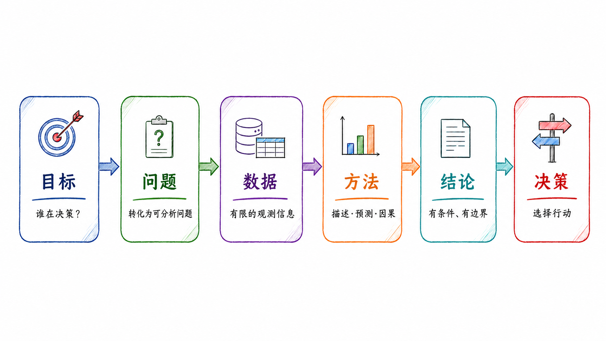
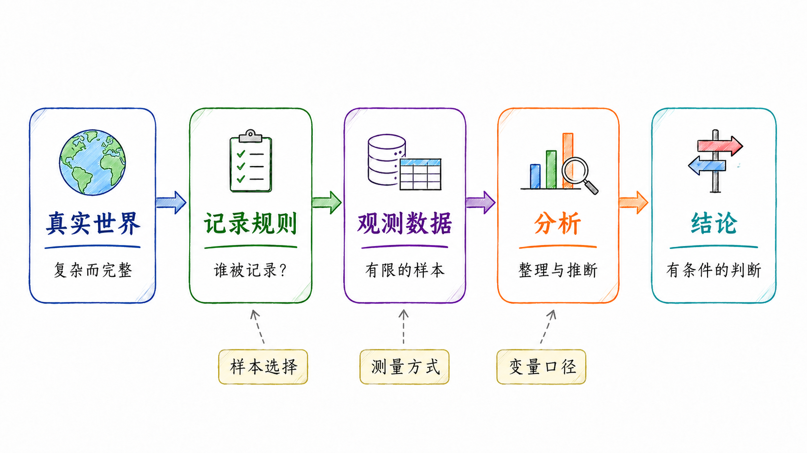
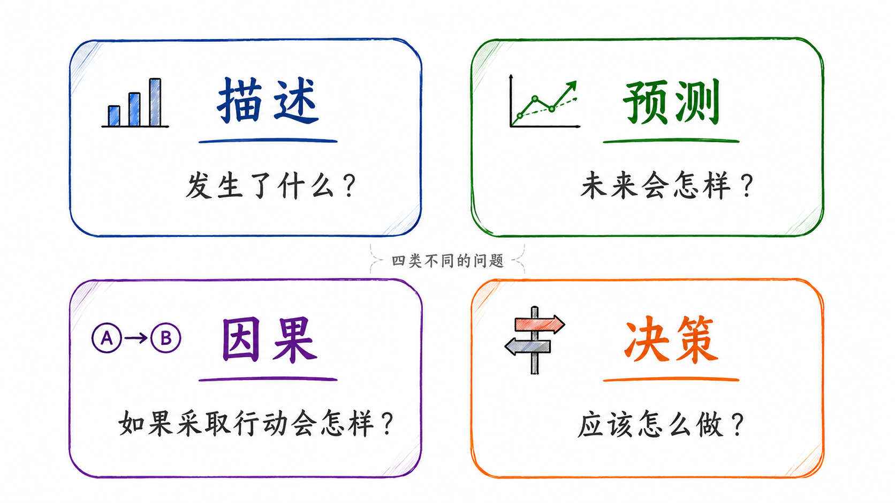

# 数据分析概览

## 什么是数据分析？

我们每天都在做决策：是否买房，是否投资一只股票，是否接受一份工作，是否推出一种产品，是否调整一项政策。很多时候，我们并没有充分信息，却必须做出选择。数据分析的价值，正是在这种不确定性中体现出来的。

数据分析不是从软件开始的，也不是从模型开始的。它首先要回答一个更基本的问题：

> 我们想通过数据分析改善什么决策？

因此，本课程中的数据分析不是单纯的 Python 代码、Stata 命令、图表制作或模型估计。它是一套围绕真实问题展开的分析流程：明确目标，寻找数据，理解数据的生成机制，选择合适的方法，解释结果，并把分析结论转化为可执行的判断。

简言之：

> 数据分析的起点不是数据，而是目标；数据分析的终点不是模型结果，而是决策质量。

{#fig-ds-intro-goal-to-decision width="92%" fig-align="center"}

图 @fig-ds-intro-goal-to-decision 展示了数据分析从目标到决策的一般逻辑。数据分析不是从「数据」开始，而是从「目标」开始。只有先明确谁在决策、为了什么决策、面对哪些约束，后续的问题界定、数据选择、方法使用和结论解释才有意义。

### 目标是第一位的

很多同学一开始接触数据分析时，容易把注意力放在工具上：用 Python 还是 Stata？用线性回归还是机器学习？画折线图还是热力图？这些问题当然重要，但它们不是第一位的。

数据分析首先要明确目标。

同样一组房价数据，不同人看到的问题完全不同。

- 买房者关心：现在是否适合买入？未来价格是否继续下跌？月供压力是否可控？

- 卖房者关心：当前挂牌价是否过高？是否应该降价？多长时间能够成交？

- 银行关心：抵押物价值是否充足？借款人违约风险有多大？

- 政府关心：房地产市场是否过冷？是否会影响金融稳定、地方财政和居民预期？

- 中介关心：如何促成交易？怎样给买卖双方解释价格和市场趋势？

同一份数据，因为决策主体不同、目标不同、约束条件不同，分析方法和结论也可能不同。

因此，数据分析开始之前，至少要问清楚四个问题：

- 谁在做决策？

- 他面对哪些选择？

- 他希望最大化或最小化什么？

- 错误决策的成本是什么？

这四个问题决定了后续的数据收集、变量选择、模型设定和结果解释。如果目标不清楚，后面即使模型很复杂，图表很漂亮，也可能只是形式上「很数据分析」，实质上并没有改善决策。

### 用有限数据理解未知世界

现实中的数据通常并不完美。我们拿到的数据往往是有限的、残缺的、带有偏差的。可是，决策又不能等到信息完全之后才发生。

因此，数据分析的一个基本任务，是用有限的观测信息，推断我们真正关心但无法完全观察的对象。

这些对象包括：

- 总体特征：例如某城市真实房价水平、某行业平均利润率、某类学生的学习效果。

- 潜在机制：例如房价为什么下跌，企业为什么减少投资，学生为什么缺课。

- 未来结果：例如未来一年房价是否继续下降，某公司是否会违约，某政策是否会带来长期影响。

- 因果效应：例如降低利率是否会推高房价，学校驱虫项目是否会提高出勤率，延长义务教育是否会减少青少年犯罪。

- 反事实状态：例如如果没有某项政策，结果会怎样；如果不买房而继续租房，家庭财富路径会怎样。

可以用一个简单框架表示：

$$
\text{Data} \rightarrow \text{Inference} \rightarrow \text{Decision}
$$

这里的 `Data` 不是完整世界本身，而是世界的一部分记录；`Inference` 是从这些记录中推断未知对象；`Decision` 是在推断基础上采取行动。

因此，数据分析并不是机械地「让数据说话」。数据不会自动说话。数据需要放在明确的问题、合理的假设和具体的决策情境中，才有解释意义。

### 数据不是事实本身

第一讲中需要特别强调一点：数据并不等于事实本身。

数据是事实在某种制度、平台、工具或组织流程下留下的记录。理解数据，必须理解数据是如何生成的。

例如：

- 房产平台上的挂牌价，不等于真实成交价。

- 电商评论，不等于所有消费者的真实评价。

- 股票价格来自市场交易，但财务报表来自会计制度。

- 社交媒体文本反映的是愿意发声的人，不代表沉默人群。

- 问卷数据反映的是受访者愿意回答、能够回答以及被问到的问题。

- 企业数据库中的客户信息，通常只包括已经进入企业系统的人，不包括没有被企业触达的人。

可以把观测数据理解为真实世界经过一系列记录规则之后的结果：

$$
D = g(W, R, M, S)
$$

其中，$D$ 是我们观测到的数据，$W$ 是真实世界状态，$R$ 是记录规则，$M$ 是测量方式，$S$ 是样本选择机制。

这个公式的意思并不复杂：数据不是直接从真实世界「自然流出」的，而是在特定规则下被记录、筛选和加工出来的。谁被记录，谁被遗漏，变量如何定义，错误如何产生，都会影响后续分析。

{#fig-ds-intro-data-generation width="92%" fig-align="center"}

图 @fig-ds-intro-data-generation 展示了数据生成机制。观测数据不是完整的真实世界，而是经过记录规则、样本选择、测量方式和变量口径处理之后形成的有限样本。理解数据生成机制，是判断数据能否回答研究问题的前提。

这也是为什么数据分析不能只问「有没有数据」，还要问：

- 数据是谁记录的？

- 为什么会记录这些数据？

- 哪些对象被纳入了数据？

- 哪些对象被排除在数据之外？

- 变量的定义是否稳定？

- 是否存在缺失、测量误差或选择性报告？

- 数据是否能够服务于当前分析目标？

如果忽视数据生成机制，后续模型越复杂，误导性可能越强。

### 数据分析是降低不确定性的过程

数据分析的第二个本质，是通过收集和分析信息来降低不确定性。

这里的不确定性至少包括两类。

第一类是**事实不确定性**。也就是说，我们并不清楚当前真实情况是什么。

例如，在买房问题中，购房者可能不知道：

- 同小区真实成交价是多少？

- 当前挂牌价是否虚高？

- 卖家是否急于出售？

- 同片区库存有多少？

- 未来还有多少新增供应？

第二类是**结果不确定性**。也就是说，我们不知道采取某个行动之后，未来会发生什么。

例如：

- 如果现在买房，未来一年价格会不会继续下跌？

- 如果继续等待，是否会错过合适房源？

- 如果利率变化，月供压力会怎样？

- 如果收入预期下降，家庭现金流是否安全？

数据分析的作用，是把这些模糊判断转化为更有依据的条件判断。一个简单的决策框架可以写成：

$$
a^* = \arg\max_{a \in \mathcal A} E[U(a, \theta) \mid D, I]
$$

其中，$a$ 表示可选择的行动，$\mathcal A$ 表示行动集合，$\theta$ 表示未知状态，$D$ 表示数据，$I$ 表示已有信息，$U(a,\theta)$ 表示在状态 $\theta$ 下采取行动 $a$ 带来的收益或效用。

这个公式的含义是：决策者并不是在完全确定的世界中选择行动，而是在已有信息和数据条件下，选择预期结果更好的行动。

因此，数据分析的核心价值不是消除所有不确定性，而是让我们更清楚地知道：

- 已经知道什么；

- 还不知道什么；

- 哪些判断比较稳健；

- 哪些结论依赖特定假设；

- 哪个行动在当前信息下更合理。

### 描述、预测、因果与决策

数据分析中常见的一个问题，是把不同类型的问题混在一起。事实上，描述、预测、因果和决策是四类不同任务。

它们的逻辑不同，所需数据不同，方法也不同。

{#fig-ds-intro-four-tasks width="78%" fig-align="center"}

图 @fig-ds-intro-four-tasks 展示了数据分析中的四类基本任务。描述回答「发生了什么」，预测回答「未来会怎样」，因果回答「如果采取行动会怎样」，决策回答「应该怎么做」。

可以进一步把这四类问题整理为下表：

| 类型 | 核心问题 | 例子 | 常用方法 |
|---|---|---|---|
| 描述 | 发生了什么？ | 某城市房价过去三年如何变化？ | 汇总统计、可视化、分组比较 |
| 预测 | 未来会怎样？ | 未来一年房价继续下跌的概率有多大？ | 时间序列、机器学习、预测模型 |
| 因果 | 如果采取某种行动，结果会怎样？ | 降低利率是否会推高房价？ | RCT、DID、IV、RDD、面板模型 |
| 决策 | 应该怎么做？ | 现在买房还是继续等待？ | 成本收益分析、风险分析、政策评价 |

这四类问题经常被混淆。

例如，知道房价过去三年下跌，是描述；根据历史数据预测未来一年房价，是预测；判断限购政策是否导致房价下降，是因果分析；决定自己是否应该买房，则是决策问题。

再比如，知道某地区青少年犯罪率上升，是描述；预测未来犯罪率是否继续上升，是预测；判断降低刑责年龄是否减少犯罪，是因果分析；决定刑责年龄应设为 14 岁还是 16 岁，则是公共决策问题。

这四类任务之间有联系，但不能相互替代。

一个预测模型可以很准，但未必能回答因果问题。一个因果估计结果显著，也不自动等于某项政策一定值得推行。决策还要考虑成本、收益、风险、伦理和执行条件。

### 数据分析的结论必须有边界

好的数据分析通常不会给出脱离条件的绝对结论。它更应该给出有条件、有证据、有边界的判断。

例如，不宜简单写成：

> 2026 年不适合买房。

更严谨的写法是：

> 在居民收入预期偏弱、二手房挂牌量较高、成交周期较长、租售比较低且家庭居住需求并不迫切的条件下，2026 年对投资型购房者可能不是理想入场时点；但对于现金流稳定、长期自住、能够获得明显折价且交易成本可控的购房者，结论可能不同。

这两种表述的差别很大。前者像一个口号，后者才是数据分析应有的结论方式。

因此，数据分析的结论至少要说明三件事：

- 数据支持了什么；

- 结论依赖哪些假设；

- 结论不能外推到哪里。

可以把它概括为：

$$
\text{Conclusion} = f(\text{Data}, \text{Assumptions}, \text{Method}, \text{Context})
$$

换言之，结论不是由数据单独决定的，而是由数据、假设、方法和情境共同决定的。

这也是为什么同样一组数据，不同研究者可能得出不同判断。差异不一定来自谁「不懂数据」，也可能来自分析目标不同、样本选择不同、变量口径不同、模型假设不同，或者对风险和成本的权重不同。

### 数据分析不是完全中立的

数据分析追求客观证据，但分析过程本身并不脱离立场和目标。

一个人为什么提出某个问题，为什么选择某个变量，为什么强调某个指标，为什么忽略某些成本，这些都会影响分析结论。

以「2026 年是否适合买房」为例：

- 买家可能更关注价格下行风险。

- 卖家可能更强调房源稀缺性和装修价值。

- 中介可能更关注成交可能性。

- 银行更关注抵押物安全和借款人现金流。

- 政府更关注市场稳定和系统性风险。

- 投资者更关注资产收益率、租售比和流动性。

因此，做数据分析时，一个基本训练是先问：

> 谁在问这个问题？他为什么问？他要用这个结论做什么？

这个问题可以帮助我们识别分析背后的目标函数。目标函数不同，最优选择自然可能不同。

数据分析不是让所有人得出同一个结论，而是让不同主体在明确目标、信息和约束条件的基础上，更清楚地知道自己的判断依据和风险边界。

### AI 时代的数据分析能力

在 AI 和 Agent 时代，数据分析的工作方式正在发生变化。过去，很多时间花在找资料、写代码、改报错、画图和整理报告上。现在，AI 可以帮助我们更快地完成这些任务。

例如，AI 可以帮助学生：

- 拆解开放性问题；

- 搜索可能的数据来源；

- 解释变量含义和数据口径；

- 生成 Python 或 Stata 代码；

- 修改代码报错；

- 绘制初步图表；

- 整理文献和报告结构；

- 作为反方审查员检查结论漏洞。

但是，AI 降低的是操作门槛，不是判断门槛。

学生仍然必须自己判断：

- 问题是否定义清楚；

- 数据是否可信；

- 变量是否合适；

- 模型是否回答了原问题；

- 结论是否过度外推；

- AI 给出的事实是否经过核验；

- 代码是否真正运行；

- 图表是否正确表达了数据。

因此，本课程鼓励使用 AI，但不鼓励把 AI 当成答案生成器。AI 更适合作为协作工具，而不是替代学生完成判断的工具。

可以把 AI 在本课程中的定位概括为：

> AI 可以加速分析，但不能替代判断。

或者更具体地说：

> AI 可以帮助我们更快地完成资料搜集、代码生成、图表制作和报告整理，但问题意识、数据判断、模型选择和结论责任仍然属于人。

这也是为什么本课程后续作业会要求同学记录 AI 使用过程，包括提示词、AI 输出、人工修改、错误核验和最终判断。我们关心的不只是最后的答案，还关心答案是如何产生的。

### 小结

本节的核心观点可以概括为三句话。

第一，数据分析的起点不是数据，而是目标。只有明确谁在决策、为了什么决策、面对哪些约束，数据和模型才有方向。

第二，数据不是事实本身，而是事实在特定记录规则、测量方式和样本选择机制下留下的观测结果。理解数据生成机制，是理解数据分析的前提。

第三，数据分析的目的不是给出一个脱离条件的确定答案，而是在有限信息下形成更有证据、更有边界、更有可解释性的判断，并最终服务于决策。


## 数据分析如何帮助决策？

前面已经说明，数据分析的目标不是「算出一个结果」，而是在有限、残缺、有偏的数据条件下，帮助我们更好地理解事实、识别机制、预测结果，并在不确定性中做出更合适的行动选择。

本节通过几个案例说明：同样是数据分析，不同问题对应的目标函数、数据来源、识别策略和结论边界完全不同。

{#fig-ds-intro-analysis-process width="90%" fig-align="center"}

图 @fig-ds-intro-analysis-process 展示了一个较为完整的数据分析流程。实际分析往往不是严格线性的，而是在「问题界定—数据获取—方法选择—结果解释」之间反复迭代。

### 刑责年龄的确定：14 岁还是 18 岁？

刑责年龄是一个很适合放在数据分析导论中的公共政策案例。它表面上是一个法律问题，实质上涉及犯罪控制、教育矫治、社会成本、受害者保护和未成年人长期发展。

讨论这个问题时，首先要区分两个概念：

- **最低刑事责任年龄**：未成年人达到什么年龄之后，才可能进入刑事责任体系。

- **少年司法管辖年龄上限**：一个人到多少岁之前，仍然优先由少年司法体系处理，而不是直接进入成人刑事司法体系。

因此，「14 岁还是 18 岁」不是一个简单的年龄选择，而是两类制度设计：

- 是否要把更低年龄段的严重违法行为纳入刑事责任范围？

- 是否要把 16、17 岁，甚至更高年龄段的青年继续纳入少年司法体系？

不同国家和地区的政策方向并不完全一致。有些改革强调降低特定严重犯罪的追责年龄，有些改革则强调把更多青少年留在少年司法体系中，避免过早进入成人刑事司法体系。

从数据分析角度看，这个问题至少包含三类机制。

第一类机制是**威慑**。如果处罚概率和处罚强度上升，潜在违法者可能因为预期成本上升而减少犯罪行为。这个逻辑来自犯罪经济学的基本思路：个体行为受到收益、成本和被处罚概率的共同影响。

第二类机制是**失能**。如果违法者被羁押、管束或接受封闭式矫治，他在特定时期内再次犯罪的机会会减少。这种机制不一定改变其长期偏好，但会改变其短期可行动空间。

第三类机制是**教育和矫治**。未成年人仍处在身心发展阶段。一个制度如果能通过教育、心理干预、家庭支持和社区矫正降低再犯概率，就可能在长期产生更高的社会收益。

问题的困难在于，这三类机制可能方向不同。更严厉的刑罚可能在短期内减少部分犯罪，但也可能损害教育完成、就业机会和社会融入，从而提高长期再犯风险。相反，教育矫治的短期威慑可能不强，但可能改善长期人力资本和社会关系。

因此，刑责年龄的确定不是简单比较「宽」和「严」，而是要比较不同制度安排的长期净效果。我们关心的结果变量也不应只包括当期犯罪率，还应包括：

- 再犯率；

- 高中或大学完成率；

- 成年后就业状况；

- 成年后犯罪记录；

- 受害者损失；

- 家庭和社区影响；

- 司法系统成本；

- 社会安全感。

如果把这个问题转化为数据分析问题，可以这样表达：

> 在其他条件尽可能可比的情况下，降低或提高刑责年龄，会如何影响青少年犯罪、再犯、教育、就业和长期社会成本？

这个案例可以帮助我们理解：公共政策分析不能只停留在情绪和立场上。数据分析的作用，是把争议性问题转化为可观察、可比较、可检验的问题。

课堂讨论时，可以引导学生思考：

- 如果降低刑责年龄后，短期犯罪率下降，但长期再犯率上升，这项政策是否成功？

- 如果少年司法体系成本更高，但能显著降低成年后犯罪率，是否值得投入？

- 如果政策对初犯和累犯的影响不同，是否应该采用分层制度？

- 如果教育和社区干预也具有「失能」作用，是否应把学校、家庭和司法系统放在同一个分析框架中？

这一案例的重点不是让学生立即回答刑责年龄应该是多少，而是训练他们识别政策问题背后的目标、机制、数据和长期后果。

### 肯尼亚学校的驱虫药项目：外部性、随机实验与政策评价

肯尼亚学校驱虫药项目是发展经济学和政策评价中非常经典的案例。这个案例之所以重要，是因为它不仅展示了随机实验如何帮助识别政策效果，还说明了外部性、长期追踪和成本收益分析为什么重要。

研究背景是：肠道寄生虫感染会影响儿童健康、营养吸收和上学情况。对儿童进行驱虫治疗，可能改善健康，也可能提高出勤率。但这个问题并不只是「服药儿童是否受益」这么简单，因为寄生虫具有传染性。

一个儿童接受治疗后，周围儿童的感染风险也可能下降。也就是说，驱虫药项目存在正外部性。

这会带来一个重要问题：如果我们只比较服药儿童和未服药儿童，可能会低估项目的真实社会收益。因为未服药儿童也可能因周围儿童接受治疗而间接受益。

在传统因果推断中，我们通常希望一个人的处理状态不影响另一个人的潜在结果。但在传染病、教育、网络、社区治理等场景中，这一条件经常不成立。一个人的处理会影响他人的结果，这就是外部性或溢出效应。

可以用一个简单框架表示：

$$
\text{Policy Effect} = \text{Direct Effect} + \text{Spillover Effect}
$$

在驱虫药项目中，直接效应是服药儿童本人的健康和出勤变化；溢出效应是同校或邻近学校儿童因传染风险下降而获得的收益。

这个案例至少可以从四个角度理解。

第一，**为什么不能只看个体效果？**

如果驱虫药能降低传播风险，那么一个学生是否受益，不仅取决于自己是否服药，也取决于周围同学是否服药。因此，个体层面的随机分组可能无法完整估计项目的社会收益。

第二，**为什么要考虑学校层面的随机化？**

由于传染和学校环境密切相关，以学校为单位进行干预，能够更好地捕捉集体环境变化带来的影响。这样不仅可以估计接受治疗学校学生的变化，还可以观察邻近学校是否出现外溢收益。

第三，**为什么政策结论不只是「有没有效果」？**

如果一个项目存在强外部性，个体支付意愿可能低估社会收益。也就是说，即使某些家庭不愿意自己付费购买驱虫药，社会层面仍然可能有理由免费提供或补贴提供。

第四，**为什么要追踪长期效果？**

短期结果可能只体现为健康和出勤变化，但长期结果可能体现在教育完成、劳动收入、职业选择和家庭生活上。公共政策评价如果只看短期指标，可能低估儿童健康投资的真实价值。

这个案例可以总结为：

$$
\text{Health Intervention}
\rightarrow
\text{School Attendance}
\rightarrow
\text{Human Capital}
\rightarrow
\text{Long-run Outcomes}
$$

需要注意的是，驱虫药项目也提醒我们：好的数据分析不只是估计一个平均处理效应。我们还要理解政策作用机制、干预对象、外部性范围、长期收益和成本收益关系。

课堂讨论时，可以让学生思考：

- 如果控制组也因为外部性而受益，传统处理效应会如何变化？

- 如果考试成绩短期没有显著改善，但出勤率提高，是否说明项目无效？

- 如果项目长期提高了劳动收入，是否应该把它视为教育政策、卫生政策，还是发展政策？

- 如果一个政策存在外部性，免费发放是否比让家庭自费更合理？

这个案例适合引导学生理解：数据分析不是单纯比较两组均值，而是围绕机制、外部性和长期后果形成政策判断。

### 日本失去的十年、二十年、三十年：繁荣、泡沫与长期调整

日本经济的长期停滞，是理解宏观经济、房地产周期、资产价格泡沫和政策应对的经典案例。它也可以帮助我们理解为什么判断「现在是否适合买房」不能只看一两个月的房价变化，而要放在更长周期中分析。

1970 年代到 1980 年代前期，日本制造业和出口部门快速发展。汽车、电子、机械等产业在全球市场中竞争力很强，日本经济呈现出较高增长、较强出口和较高企业投资的特征。

1985 年广场协议之后，日元快速升值，日本出口部门面临压力。为了缓冲升值对经济的冲击，日本采取了较为宽松的货币和财政政策。低利率、信用扩张、土地抵押融资和乐观预期共同推动了 1980 年代后期的资产价格泡沫。

{#fig-ds-intro-japan-timeline width="92%" fig-align="center"}

图 @fig-ds-intro-japan-timeline 概括了日本从出口繁荣、广场协议、资产价格泡沫到泡沫破裂和长期调整的主要阶段。这个案例的重点不是简单类比其他国家，而是帮助我们理解资产价格、信贷、政策和实体经济之间的联动。

资产泡沫形成过程中，房地产和股票价格上涨会提高抵押品价值，抵押品价值上升又会扩大信贷供给，信贷扩张进一步推高资产需求和价格。这种正反馈可以用一个简单链条表示：

$$
P \uparrow \Rightarrow Collateral \uparrow \Rightarrow Credit \uparrow \Rightarrow Demand \uparrow \Rightarrow P \uparrow
$$

其中，$P$ 表示资产价格，$Collateral$ 表示抵押品价值，$Credit$ 表示信贷供给，$Demand$ 表示资产需求。

这个公式不是为了精确刻画所有机制，而是帮助我们理解：资产价格上涨并不总是来自基本面改善，也可能来自价格、抵押品和信贷之间的相互强化。

1990 年前后，日本资产价格开始下跌。房地产和股票价格下跌后，企业资产负债表恶化，银行不良贷款上升，信贷供给收缩，企业投资下降，经济进入长期低增长和低通胀状态。

{#fig-ds-intro-tokyo-hpi width="88%" fig-align="center"}

图 @fig-ds-intro-tokyo-hpi 展示了日本房地产价格长期调整的示意。正式研究中，应使用日本官方地价数据、BIS 住宅价格指数或 FRED 数据重新绘制，并注明口径、基期和数据来源。

日本案例至少可以从四个角度分析。

第一，**资产价格为什么会形成泡沫？**

泡沫通常不是由单一因素造成的。低利率、信贷扩张、金融监管、土地制度、企业融资结构、投资者预期和产业繁荣都可能共同发挥作用。数据分析需要区分基本面上涨和非理性繁荣。

第二，**泡沫破裂为什么会影响实体经济？**

房地产和股票价格下跌不仅影响投资者财富，还会影响企业抵押能力、银行资产质量和居民消费预期。资产价格冲击通过金融体系传导到投资、就业和消费，最终影响长期经济增长。

第三，**为什么会出现长期调整？**

如果企业、银行和居民都在修复资产负债表，经济可能进入低投资、低通胀、低增长状态。即使名义利率下降，企业也可能因为需求不足和资产负债表压力而不愿扩大投资。

第四，**为什么不能机械类比？**

日本经验很重要，但不能简单套用到其他国家。不同国家在人口结构、居民杠杆、银行体系、财政空间、产业竞争力、城市化阶段和政策工具方面差异很大。比较历史经验时，既要看相似性，也要看差异性。

{#fig-ds-intro-japan-impact width="90%" fig-align="center"}

图 @fig-ds-intro-japan-impact 概括了资产泡沫破裂后可能影响实体经济和民生的若干渠道。资产价格下跌本身不是全部问题，关键在于它如何通过金融体系、企业投资、居民财富和就业预期传导到真实经济。

这个案例可以和前面的买房问题联系起来。判断某个城市当前是否适合买房，不能只看某套房源是否便宜，也不能只看当前利率是否较低。更重要的是要分析：

- 房价是否偏离收入和租金基本面；

- 信贷扩张是否支撑了此前价格上涨；

- 居民杠杆和现金流是否安全；

- 人口、就业和收入是否支持长期需求；

- 当前挂牌价和成交价是否分化；

- 政策是否有足够空间缓冲调整；

- 买房是自住、改善，还是投资。

日本案例的教学意义在于，它提醒我们：经济决策不能只看眼前价格，也要看长期周期、资产负债表和制度环境。

## 数据分析的一般流程

前面几个案例说明，数据分析不是一个简单的技术动作，而是一套从目标到决策的完整流程。不同问题的细节不同，但基本步骤具有共通性。

### 明确目标

数据分析首先要明确目标，而不是直接寻找数据或套用模型。

需要回答的问题包括：

- 谁要做决策？

- 面对哪些行动选项？

- 决策目标是什么？

- 时间范围是什么？

- 错误决策的成本是什么？

例如，「2026 年是否适合买房」这个问题太宽泛。它至少要进一步明确：

- 是哪个城市？

- 是自住、改善还是投资？

- 是新房还是二手房？

- 是短期持有还是长期持有？

- 家庭现金流和融资约束是什么？

只有目标明确，后续数据和方法才有方向。

### 界定问题

开放性问题通常不能直接分析，需要转化为可操作的问题。

例如：

> 2026 年是否适合买房？

可以转化为：

> 在广州某片区，预算 1600 万左右、长期自住、现金流稳定、可接受一定价格波动的购房者，是否应该在 2026 年买入一套二手改善型住房？

经过转化后，问题变得更具体，也更容易设计数据收集方案。

### 寻找数据

数据来源可以包括官方统计、商业数据库、平台数据、实地调研、专家访谈和文本资料。不同数据来源有不同优缺点。

例如，房价分析可以使用：

- 官方房价指数；

- 小区历史成交记录；

- 当前挂牌价；

- 中介带看和成交反馈；

- 银行贷款利率；

- 人口和收入数据；

- 周边配套和交通信息；

- 实地看房记录。

数据来源越多，并不一定意味着分析越好。关键在于这些数据是否能够服务于当前问题。

### 理解数据生成机制

拿到数据之后，不应急于建模。我们需要先理解数据是如何生成的。

例如：

- 平台挂牌价可能高于真实成交价；

- 成交价数据可能缺少未成交样本；

- 问卷数据可能存在主观偏差；

- 企业财务数据受到会计准则影响；

- 社交媒体数据反映的是愿意发声的人群；

- 官方统计数据有稳定口径，但可能频率较低、颗粒度较粗。

{#fig-ds-intro-bias-sources width="86%" fig-align="center"}

图 @fig-ds-intro-bias-sources 概括了数据分析中常见的偏误来源。数据质量问题并不总是可以通过复杂模型解决，很多时候需要回到数据生成机制本身。

### 清洗和整理数据

数据清洗包括：

- 处理缺失值；

- 识别异常值；

- 统一变量口径；

- 合并不同来源数据；

- 调整时间频率；

- 构造分析变量；

- 保留处理日志。

数据清洗不是低级工作。很多实证分析的质量差异，恰恰来自变量定义、样本筛选和数据处理过程。

### 描述性分析

在建模之前，应该先做描述性分析。描述性分析的目的不是炫耀图表，而是理解数据结构。

常见问题包括：

- 样本有多大？

- 变量分布如何？

- 是否存在极端值？

- 时间趋势是否明显？

- 分组差异是否显著？

- 变量之间是否存在初步相关关系？

描述性分析可以帮助我们发现数据问题，也可以帮助我们形成初步假设。

### 选择分析方法

方法选择要服从问题类型。不同问题不能用同一种方法简单替代。

{#fig-ds-intro-method-types width="88%" fig-align="center"}

图 @fig-ds-intro-method-types 概括了常见数据分析方法的类型。方法本身没有高低之分，关键是它是否匹配研究问题和数据条件。

如果目标是描述现象，可以使用汇总统计、分组比较和可视化。

如果目标是预测未来，可以使用时间序列模型、机器学习模型或组合预测方法。

如果目标是识别因果效应，则需要考虑实验、准实验、工具变量、断点回归、双重差分或面板模型等方法。

如果目标是形成决策建议，还需要进一步考虑成本、收益、风险、约束和执行条件。

### 解释结果

模型结果不是分析的终点。真正重要的是解释结果。

解释结果时需要回答：

- 结果是否符合经济直觉？

- 估计量或预测结果的含义是什么？

- 结果在统计上是否显著？

- 结果在经济上是否重要？

- 结论对样本、变量和模型是否敏感？

- 是否存在替代解释？

- 结论适用于哪些场景？

### 形成决策建议

最后，数据分析要回到决策。

一个好的决策建议通常包括：

- 主要结论；

- 支持证据；

- 关键假设；

- 风险提示；

- 适用边界；

- 可执行行动。

例如，不应简单写成「现在可以买房」或「现在不能买房」。更好的写法是：

> 如果购房目的是长期自住，家庭现金流稳定，房源价格相对同类成交有明显折价，且能接受未来两三年价格继续波动，那么可以考虑进入实质谈判；如果购房目的是短期投资，且需要较高杠杆，则应更加谨慎。

这样的结论才真正服务于决策。

## 数据类型、数据来源与数据平台

数据分析的对象已经远远不限于传统表格。随着数字经济、平台经济和 AI 工具的发展，我们可以使用的数据形态越来越丰富，数据来源也越来越多样。

### 数据类型

从形态上看，常见数据可以分为四类。

{#fig-ds-intro-data-types width="80%" fig-align="center"}

图 @fig-ds-intro-data-types 展示了常见数据类型。现实分析中，很多项目并不只使用一种数据，而是把结构化数据、文本数据、图像数据和行为数据结合起来。

第一类是**结构化数据**。这类数据通常以表格形式存在，变量和观测单位比较清楚。例如财务报表、交易记录、问卷数据、宏观经济数据和面板数据。

第二类是**半结构化数据**。这类数据具有一定结构，但不一定直接表现为规范表格。例如网页、JSON 文件、XML 文件、API 返回结果和日志数据。

第三类是**非结构化数据**。这类数据没有固定表格结构，例如新闻、公告、研报、论文、图片、音频和视频。

第四类是**多模态数据**。这类数据同时包含文本、图像、位置、时间、行为轨迹等多种信息。例如一条电商记录可能同时包含商品图片、标题、评论文本、价格、点击量和交易时间。

不同数据类型对应不同处理方法。结构化数据适合使用传统统计和计量方法；文本数据需要自然语言处理；图片和视频需要计算机视觉；多模态数据则需要把不同信息来源放在统一框架中处理。

### 数据来源

从生成机制看，数据可以来自不同机构和场景。

{#fig-ds-intro-data-sources width="88%" fig-align="center"}

图 @fig-ds-intro-data-sources 展示了常见数据来源。数据平台的作用，是把分散数据源接入更稳定的分析工作流，使数据能够被代码、图表、报告和 AI-Agent 共同调用。

常见数据来源包括：

- **官方统计数据**：国家统计局、央行、财政、海关、人口普查、地方统计年鉴等。

- **行政记录数据**：工商注册、税务、司法裁判、专利、社保、教育、医疗等。

- **市场交易数据**：股票、债券、基金、房地产、招聘、消费、电商等。

- **平台行为数据**：搜索、点击、浏览、评分、评论、转发、推荐等。

- **实验数据**：实验室实验、田野实验、A/B 测试等。

- **文本数据**：年报、公告、政策文本、新闻报道、社交媒体内容等。

- **地理和遥感数据**：夜间灯光、卫星影像、POI、道路网络、气候数据等。

不同数据来源有不同优势。官方统计数据权威、口径稳定，但颗粒度可能较粗；平台数据频率高、细节丰富，但可能存在样本选择和商业口径问题；商业数据库整理程度高，但成本较高，且使用范围受到授权限制；网页数据获取灵活，但稳定性和合规性需要特别注意。

### 数据平台

在实际学习和研究中，学生不仅要知道数据类型，还要知道可以从哪些平台获得数据。下面列出几类适合教学、练习和研究入门的平台。

**Kaggle** 适合机器学习练习、公开数据探索和 Notebook 复现。它的优势是数据、代码和讨论经常放在一起，适合学生学习完整的数据分析流程。

**FRED** 适合宏观经济、利率、通胀、就业、GDP、资产价格等时间序列分析。它的数据接口相对规范，适合课堂演示和宏观金融分析。

**World Bank Open Data** 适合国家层面的发展、贫困、人口、教育、金融、贸易和治理指标，适合做跨国比较和发展经济学案例。

**OECD Data Explorer** 适合发达经济体和部分新兴经济体的宏观、产业、贸易、教育、劳动和创新数据。

**Hugging Face Datasets** 适合文本、图像、音频和多模态数据，尤其适合自然语言处理和机器学习课程。

**OpenBB** 适合金融数据、宏观金融、资产价格、公司基本面和 AI-Agent 数据调用。它的价值不只是获取某个金融变量，而是把分散数据源接入 Python、API、Workspace 和 AI-Agent 等不同工作流。

**中国常用数据平台** 包括国家统计局、人民银行、财政部、巨潮资讯、CSMAR、Wind、同花顺 iFinD、RESSET、企查查、天眼查、AkShare 和 Tushare 等。教学中可以把它们分成官方数据源、商业数据库、开源接口和网页采集四类来介绍。

需要强调的是，数据平台降低了获取数据的成本，但不自动保证数据质量。任何数据进入正式分析之前，都必须检查：

- 数据口径；

- 样本范围；

- 更新时间；

- 缺失情况；

- 变量定义；

- 使用权限；

- 是否可以复现。

## AI 和 Agent 如何辅助数据分析？

在 AI 和 Agent 时代，数据分析的工作方式正在发生变化。过去，学生需要自己完成资料搜索、代码编写、报错修改、图表制作和报告整理。现在，AI 可以帮助我们更快地完成其中很多步骤。

但这并不意味着数据分析变得不需要判断。恰恰相反，AI 降低了操作门槛，却提高了对问题定义、数据核验和结论审查的要求。

### 什么是 Agent？

普通聊天式 AI 更像是一次问答：

$$
Prompt \rightarrow Answer
$$

Agent 则更像是一个围绕目标持续行动的系统：

$$
Goal \rightarrow Plan \rightarrow Tool \ Use \rightarrow Observation \rightarrow Revision \rightarrow Output
$$

也就是说，Agent 不只是回答问题，还可以调用工具、读取文件、运行代码、访问数据源、生成图表、修改错误，并根据中间结果继续调整行动。

在数据分析中，Agent 可以承担如下角色：

- **问题拆解员**：把开放问题拆成可分析问题。

- **资料侦察员**：寻找可能的数据来源、变量口径和相关研究。

- **数据工程师**：帮助写爬虫、API 调用、数据清洗和数据合并代码。

- **分析建模员**：提出描述性分析、预测模型或因果识别方案。

- **反方审查员**：指出样本偏误、变量口径、替代解释和模型缺陷。

- **报告编辑员**：帮助整理图表、摘要、结论和附录。

{#fig-ds-intro-decision-framework width="88%" fig-align="center"}

图 @fig-ds-intro-decision-framework 展示了 AI 和 Agent 可以嵌入的数据分析决策框架。AI 可以帮助处理资料、数据和代码，但目标设定、关键判断和结论责任仍然属于人。

### AI 可以做什么？

在本课程中，AI 可以帮助同学完成以下任务：

- 把开放性问题拆成可分析问题；

- 搜索可能的数据来源；

- 解释变量含义和数据口径；

- 生成 Python 或 Stata 代码；

- 修改代码报错；

- 绘制初步图表；

- 整理文献和报告结构；

- 生成报告初稿；

- 作为反方审查员检查结论漏洞。

例如，当你要分析「2026 年是否适合买房」时，可以让 AI 先帮助你完成问题拆解：

```text
请把「2026 年是否适合买房」这个开放性问题拆解为一个可执行的数据分析任务。

要求：
1. 区分不同决策主体，例如刚需购房者、改善型购房者、投资者、银行和政府；
2. 为每类主体说明其关注的核心指标；
3. 列出可以收集的数据来源；
4. 给出可能使用的分析方法；
5. 指出这一问题中最容易被忽视的假设和风险。
````

AI 给出的结果不能直接作为最终答案，但可以帮助我们更快地形成分析框架。

### AI 不能替代什么？

AI 不能替代以下判断：

* 这个问题是否值得分析；

* 数据是否真实可靠；

* 变量定义是否合理；

* 模型是否回答了原问题；

* 结论是否超过了数据支持范围；

* 分析是否存在利益相关或价值立场；

* 最终建议是否可执行。

因此，本课程鼓励使用 AI，但不鼓励把 AI 当作答案生成器。AI 更适合作为协作工具，而不是替代学生完成判断的工具。

### 可以尝试的平台和仓库

对于希望进一步探索 AI-Agent 数据分析的同学，可以从以下方向入手。

**OpenBB** 适合金融数据、公司基本面、宏观变量和资产价格分析。它可以作为金融数据进入 AI-Agent 工作流的入口。

**LangChain / LangGraph** 适合学习工具调用、链式调用、记忆、检索增强和可控 Agent 工作流。

**LlamaIndex** 适合把 PDF、网页、数据库、API 和本地资料接入大语言模型，构建文献问答、知识库检索和 RAG 应用。

**CrewAI** 适合学习多 Agent 分工协作，例如把资料搜索、数据清洗、建模分析和报告审查分配给不同角色。

**Dify / Flowise** 适合编程基础较弱的同学，用可视化方式搭建 RAG、工作流和 Agent 原型。

学生不需要一开始就掌握所有工具。更合适的学习路径是：

1. 先用 ChatGPT 或 Claude 拆解问题和生成代码；

2. 再用 Python 或 Stata 跑通一个小型数据分析任务；

3. 然后尝试使用 OpenBB、Kaggle 或 FRED 获取真实数据；

4. 最后再探索 Agent 工作流，把资料、数据、代码和报告连接起来。

### AI 使用说明

本课程作业可以使用 AI，但必须提交 AI 使用说明。说明内容包括：

* 使用了哪些 AI 工具；

* AI 承担了哪些任务；

* 使用了哪些关键提示词；

* 哪些内容由人工修改；

* 哪些事实经过核验；

* 仍然可能存在哪些问题。

可以使用如下模板：

```markdown
## AI 使用说明

本次作业使用了如下 AI 工具：

- 工具名称：
- 使用环节：
- 关键提示词：
- AI 输出的主要内容：
- 人工修改内容：
- 已核验内容：
- 仍可能存在的问题：
```

这一要求的目的不是限制 AI 使用，而是让数据分析过程可追溯、可检查、可复现。

## 本讲作业

本讲作业的目标，是让同学完成一次小型的数据分析设计，而不是立即做一个复杂模型。

### 作业一：把开放问题转化为数据分析问题

请选择一个开放性经济决策问题，例如：

* 2026 年是否适合买房？

* 某个城市的房价是否已经接近底部？

* 某只股票近期上涨是否有基本面支撑？

* 某类职业的招聘需求是否在下降？

* 某个商圈是否适合开一家咖啡店？

要求完成以下内容：

* 明确决策主体；

* 明确行动选项；

* 明确核心目标；

* 列出至少三个关键变量；

* 列出至少两个可能的数据来源；

* 说明可能存在的数据偏误；

* 给出一个初步分析流程图或文字说明。

### 作业二：AI 辅助分析日志

请使用 AI 辅助完成作业一，并提交 AI 使用日志。

日志至少包括：

* 一条用于问题拆解的提示词；

* 一条用于搜索数据源的提示词；

* 一条用于反方审查的提示词；

* AI 输出中的一个错误或不足；

* 你的人工修正说明。

### 作业三：数据说明表

请选择一个与你的分析问题相关的数据源，并填写数据说明表。

```markdown
## 数据说明表

- 数据名称：
- 数据来源：
- 获取方式：
- 样本范围：
- 时间区间：
- 观测单位：
- 核心变量：
- 数据频率：
- 缺失值情况：
- 可能的数据偏误：
- 使用限制：
```

## 本讲小结

本讲的核心观点可以概括为三点。

第一，数据分析的起点不是数据，而是目标。只有明确谁在决策、为了什么决策、面对哪些约束，数据和模型才有方向。

第二，数据不是事实本身，而是在特定记录规则、测量方式和样本选择机制下形成的观测结果。理解数据生成机制，是理解数据分析的前提。

第三，AI 和 Agent 可以显著提高数据分析效率，但不能替代人的判断。学生可以借助 AI 完成资料搜集、代码生成和报告整理，但必须自己负责问题定义、数据核验、模型选择和结论边界。

本课程后续内容将围绕这条主线展开：从数据获取、数据清洗、可视化和描述性分析开始，逐步进入回归分析、因果推断、机器学习、文本分析和 AI-Agent 辅助研究工作流。


