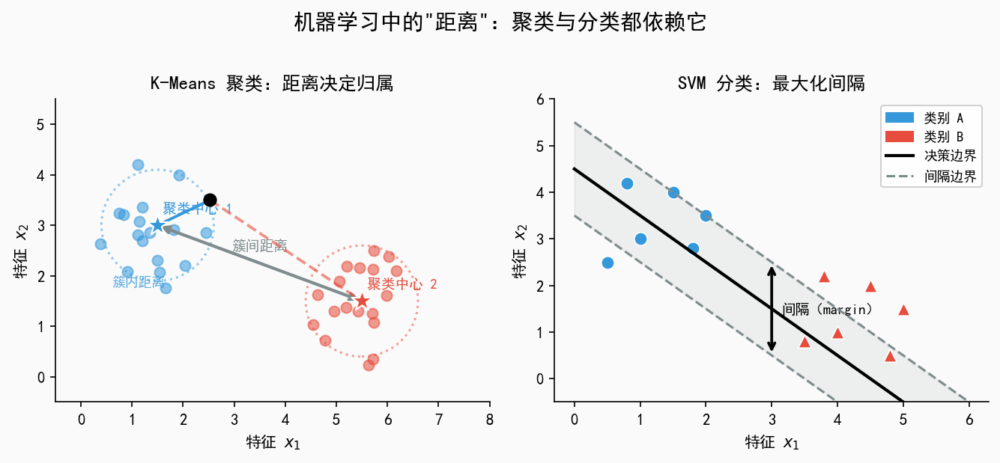
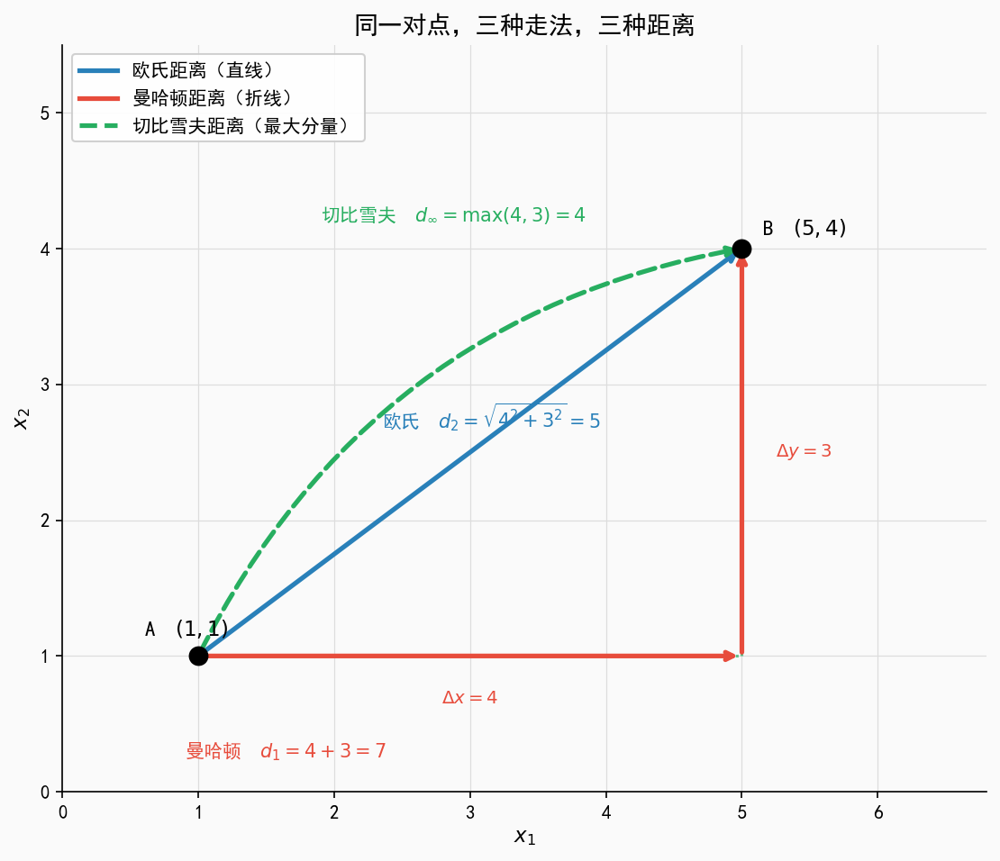
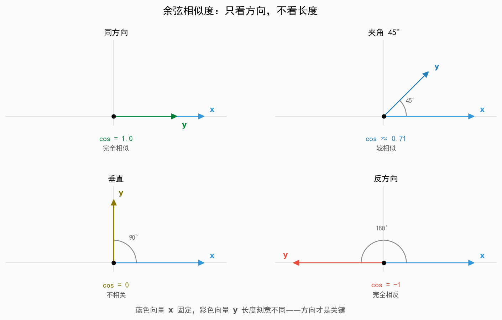
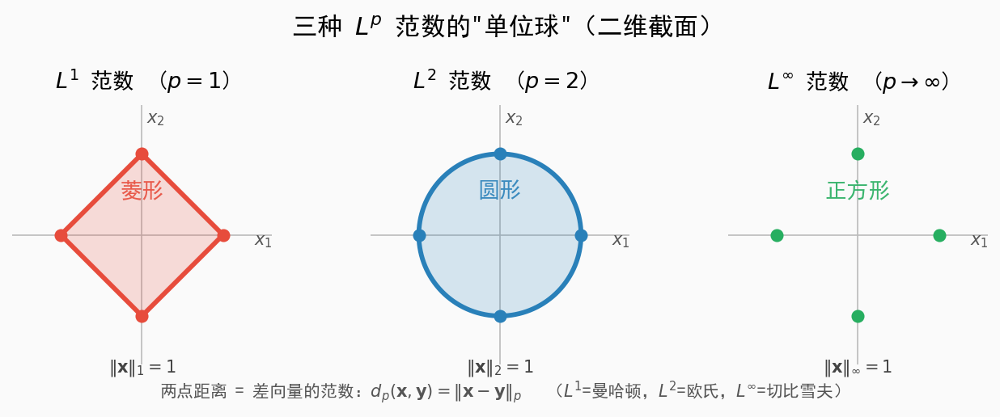
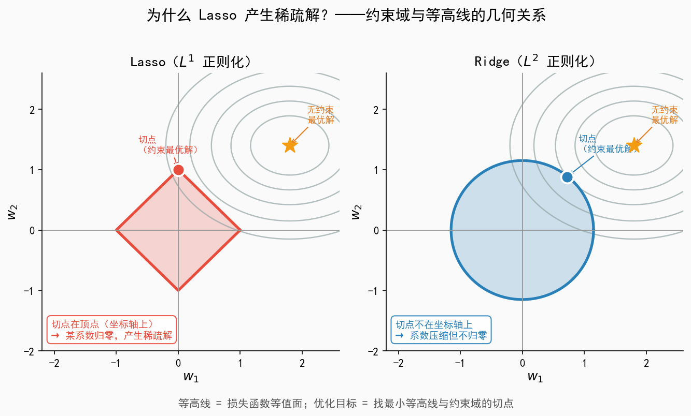

# 你在论文里见过的那些距离和范数，其实是同一件事

> 你有没有遇到过这样的场景：读一篇机器学习论文，突然出现了 $\|\mathbf{w}\|_2^2$、$d(\mathbf{x}, \mathbf{y})$，或者 $\ell_1$ 正则化——教材默认你懂，但你不太确定自己是否真的懂？
>
> 这篇文章帮你把这些概念一次性打通：**距离是直觉，范数是工具，损失函数和正则化是它们在模型里的具体任务。**

---

## 一、为什么要有"距离"？

在机器学习里，几乎所有算法都在回答同一个问题：**这两个东西，像不像？**

而"像不像"，需要一把尺子——这把尺子，就是距离。

下面两张图是最典型的例子：

- **左图（K-Means 聚类）**：算法需要衡量每个样本点到各个聚类中心的距离，把它分配给最近的那个中心。簇内距离越小、簇间距离越大，聚类效果越好。
- **右图（SVM 分类）**：算法寻找一条分类边界，使两类样本离边界的距离（间隔）尽可能大。间隔越宽，模型泛化能力越强。

这些方法里，**你用什么距离，直接影响模型的行为和结果**。距离的选择，不是无关紧要的技术细节，而是算法的核心假设之一。

---

## 二、三种经典距离

给定二维平面上的两个点 $A$ 和 $B$，从 A 走到 B，有三种完全不同的"走法"，对应三种距离：

### 欧氏距离（Euclidean Distance）

$$d_2(\mathbf{x}, \mathbf{y}) = \sqrt{\sum_{i=1}^n (x_i - y_i)^2}$$

**直觉**：两点之间，直线最短。如同飞机直飞北京到上海，不绕路，走的就是欧氏距离。

**特点**：对各维度的差异一视同仁，但对**量纲**非常敏感——如果一个特征是身高（cm），另一个是体重（kg），距离会被数值大的特征主导，使用前通常需要标准化。

> 📌 **使用场景**：KNN、K-Means、PCA、SVM（RBF 核）

---

### 曼哈顿距离（Manhattan Distance）

$$d_1(\mathbf{x}, \mathbf{y}) = \sum_{i=1}^n |x_i - y_i|$$

**直觉**：在纽约曼哈顿的棋盘式街道上开车，只能横走或竖走，不能抄近路——只能沿街区折线行驶。

**特点**：用绝对值代替平方，对**异常值更鲁棒**。一个极端值在欧氏距离中会被平方放大，但在曼哈顿距离中只是线性叠加。

> 📌 **使用场景**：图像像素差异度量、对异常值敏感的场景

---

### 切比雪夫距离（Chebyshev Distance）

$$d_\infty(\mathbf{x}, \mathbf{y}) = \max_i |x_i - y_i|$$

**直觉**：国际象棋里国王的走法——横、竖、斜都算一步。从 A 到 B，国王需要走几步，就是切比雪夫距离。

**特点**：只关注**差异最大的那个维度**，其他维度的差异完全不影响结果。

> 📌 **使用场景**：仓储机器人路径规划、棋盘问题、制造业公差分析

---

### 补充：余弦相似度（Cosine Similarity）

$$\cos(\mathbf{x}, \mathbf{y}) = \frac{\mathbf{x} \cdot \mathbf{y}}{\|\mathbf{x}\| \cdot \|\mathbf{y}\|}$$

严格来说，余弦相似度**不是距离**（不满足三角不等式），但在机器学习中极为常用。

**直觉**：不看两个向量有多长，只看它们的**方向是否一致**。

如上图：同方向的两个向量，无论长短，余弦值都是 1；方向垂直时为 0；方向相反时为 −1。这就是为什么一篇 1000 字和一篇 100 字的文章，只要主题相同，余弦相似度依然很高——哪怕它们的欧氏距离相差悬殊。

> 📌 **使用场景**：文本相似度、词向量（Word2Vec）、推荐系统、信息检索

---

## 三、核心升华：范数

> 你可能已经注意到，上面三种距离在公式上有某种统一的结构——都是"对差值做某种运算再求和"。**范数，就是揭示这个结构的语言。**

### 先从你熟悉的公式说起

在计量经济学和机器学习里，线性回归模型通常写成矩阵形式：

$$\mathbf{y} = \mathbf{X}\boldsymbol{\beta} + \mathbf{e}$$

其中 $\mathbf{e} = (e_1, e_2, \ldots, e_n)'$ 是残差向量。损失函数（残差平方和）写成求和形式是：

$$L(\boldsymbol{\beta}) = \frac{1}{2n} \sum_{i=1}^n e_i^2$$

你在论文里看到的 $\|\mathbf{e}\|_2^2$，其实是**完全相同的东西**，只是换了一种更紧凑的写法：

$$\frac{1}{2n}\sum_{i=1}^n e_i^2 \quad\Longleftrightarrow\quad \frac{1}{2n}\|\mathbf{e}\|_2^2$$

其中，$\|\mathbf{e}\|_2^2$ 的定义是：

$$\|\mathbf{e}\|_2^2 = e_1^2 + e_2^2 + \cdots + e_n^2$$

把残差向量展开，完整的等价关系是：

$$L(\boldsymbol{\beta}) = \frac{1}{2n}\sum_{i=1}^n\left(y_i - \mathbf{x}_i'\boldsymbol{\beta}\right)^2 \quad\Longleftrightarrow\quad L(\boldsymbol{\beta}) = \frac{1}{2n}\|\mathbf{y} - \mathbf{X}\boldsymbol{\beta}\|_2^2$$

符号变了，数学没变。范数符号的好处是：公式更简洁，且能直接告诉你用的是哪种度量方式（这里是 $L^2$，即欧氏）。

---

### 什么是范数？

范数（Norm）是给**向量**定义"长度"或"大小"的一套规则。一个合法的范数 $\|\cdot\|$ 必须满足三条性质：

| 性质 | 数学表达 | 人话 |
|------|----------|------|
| **非负性** | $\|\mathbf{x}\| \geq 0$，且等于 $0$ 当且仅当 $\mathbf{x}=\mathbf{0}$ | 长度不能是负数；零向量长度才为零 |
| **齐次性** | $\|\alpha\mathbf{x}\| = |\alpha|\cdot\|\mathbf{x}\|$ | 向量拉长 $k$ 倍，长度也变 $k$ 倍 |
| **三角不等式** | $\|\mathbf{x}+\mathbf{y}\| \leq \|\mathbf{x}\| + \|\mathbf{y}\|$ | 两边之和不短于第三边（初中几何那条） |

只要满足这三条，你就可以用它来"量"向量的大小——这就是范数。

---

### 一个数值例子：$\mathbf{v} = (3,\ 4)$

用最简单的二维向量，把三种范数都算一遍：

$$\|\mathbf{v}\|_1 = |3| + |4| = 7 \quad\text{（曼哈顿：横走3步 + 竖走4步）}$$

$$\|\mathbf{v}\|_2 = \sqrt{3^2 + 4^2} = \sqrt{25} = 5 \quad\text{（欧氏：直线距离，勾股定理）}$$

$$\|\mathbf{v}\|_\infty = \max(|3|, |4|) = 4 \quad\text{（切比雪夫：只看最大分量）}$$

同一个向量，三种范数给出三个不同的"长度"：$7$、$5$、$4$。**范数不同，对"大小"的理解就不同。**

---

### $L^p$ 范数族：统一公式

机器学习中最常用的范数可以用一个统一公式表达：

$$\|\mathbf{x}\|_p = \left(\sum_{i=1}^n |x_i|^p\right)^{1/p}$$

| 范数 | $p$ 值 | 对 $\mathbf{v}=(3,4)$ 的结果 | 对应距离 |
|------|--------|------------------------------|----------|
| $L^1$ 范数 | $p=1$ | $7$ | 曼哈顿距离 |
| $L^2$ 范数 | $p=2$ | $5$ | 欧氏距离 |
| $L^\infty$ 范数 | $p \to \infty$ | $4$ | 切比雪夫距离 |

> **核心关系**：两点之间的距离 = 差向量的范数：$d_p(\mathbf{x}, \mathbf{y}) = \|\mathbf{x} - \mathbf{y}\|_p$

---

### 关键图：三种范数的"单位球"

理解范数还有一个非常直观的视角：**在 $\|\mathbf{x}\|_p = 1$ 的约束下，所有点构成的形状是什么？** 这些形状叫做"单位球"（Unit Ball）。

- **$L^1$ 范数 → 菱形**：顶点恰好落在坐标轴上，这个特性在后面解释 Lasso 时至关重要
- **$L^2$ 范数 → 圆形**：各方向完全对称，就是我们最熟悉的"球"
- **$L^\infty$ 范数 → 正方形**：边平行于坐标轴，由最大分量决定边界

---

## 四、损失函数：范数在模型里的角色

### 两种损失函数

线性回归的目标是找到参数，使预测值 $\hat{y}_i = \mathbf{x}_i'\boldsymbol{\beta}$ 尽量接近真实值 $y_i$。选用不同的范数来衡量"接近程度"，就得到不同的损失函数：

**均方误差（MSE）—— $L^2$ 损失**：

$$L_2(\boldsymbol{\beta}) = \frac{1}{n}\sum_{i=1}^n \left(y_i - \mathbf{x}_i'\boldsymbol{\beta}\right)^2 = \frac{1}{n}\|\mathbf{y} - \mathbf{X}\boldsymbol{\beta}\|_2^2$$

**平均绝对误差（MAE）—— $L^1$ 损失**：

$$L_1(\boldsymbol{\beta}) = \frac{1}{n}\sum_{i=1}^n \left|y_i - \mathbf{x}_i'\boldsymbol{\beta}\right| = \frac{1}{n}\|\mathbf{y} - \mathbf{X}\boldsymbol{\beta}\|_1$$

**为什么论文更常用 MSE？** $L^2$ 损失处处可微，可以直接用梯度下降求解；而 $L^1$ 损失在零点处不可微，需要次梯度等特殊方法。但 $L^1$ 损失对异常值更鲁棒——一个极端残差，在 MSE 里被平方放大，在 MAE 里只是线性叠加。

---

### 正则化：用范数约束模型复杂度

过拟合是机器学习的头号敌人。正则化在损失函数中加入对参数的"惩罚项"：

$$L(\boldsymbol{\beta}) = \underbrace{\|\mathbf{y} - \mathbf{X}\boldsymbol{\beta}\|_2^2}_{\text{数据拟合（残差越小越好）}} + \lambda \cdot \underbrace{\text{惩罚项}}_{\text{参数不能太大}}$$

**Ridge 回归（$L^2$ 正则化）**：

$$L_{\text{Ridge}}(\boldsymbol{\beta}) = \|\mathbf{y} - \mathbf{X}\boldsymbol{\beta}\|_2^2 + \lambda \|\boldsymbol{\beta}\|_2^2$$

**Lasso 回归（$L^1$ 正则化）**：

$$L_{\text{Lasso}}(\boldsymbol{\beta}) = \|\mathbf{y} - \mathbf{X}\boldsymbol{\beta}\|_2^2 + \lambda \|\boldsymbol{\beta}\|_1$$

两者只差一个范数的选择，但效果截然不同——这正是单位球形状发挥作用的地方。

---

### 关键图：为什么 Lasso 产生稀疏解？

这个优化问题等价于：在约束域 $\|\boldsymbol{\beta}\|_p \leq t$ 内，寻找损失函数的最小值点。图中椭圆是损失函数的等高线，越靠近中心损失越小；有色区域是参数的约束域。

- **Ridge（圆形约束域）**：椭圆等高线与圆相切，切点通常落在圆弧的任意位置，**不在坐标轴上** → 系数被压缩但不归零
- **Lasso（菱形约束域）**：椭圆与菱形相切，菱形的"角"（顶点）正好在坐标轴上，**切点极可能就是这个角** → 某个系数直接变为零

**这就是为什么 Lasso 能做变量选择，而 Ridge 不行。** 一个是圆的边，一个是菱形的角——几何形状决定了统计性质。

---

### 汇总：距离、范数与机器学习方法

| 概念 | 范数表达 | 在哪些方法里用到 | 核心作用 |
|------|----------|-----------------|----------|
| 欧氏距离 | $\|\cdot\|_2$ | KNN、K-Means、SVM（RBF核） | 定义相似性 |
| 曼哈顿距离 | $\|\cdot\|_1$ | 稀疏特征匹配 | 鲁棒距离度量 |
| MSE 损失 | $\|\cdot\|_2^2$ | 线性回归、神经网络 | 可微，便于梯度优化 |
| MAE 损失 | $\|\cdot\|_1$ | 稳健回归（LAD） | 对异常值鲁棒 |
| Ridge 正则化 | $\|\boldsymbol{\beta}\|_2^2$ | Ridge 回归、权重衰减 | 压缩系数，防止过拟合 |
| Lasso 正则化 | $\|\boldsymbol{\beta}\|_1$ | Lasso、稀疏学习 | 产生稀疏解，变量选择 |
| 余弦相似度 | $\|\cdot\|_2$（归一化点积） | 文本、推荐系统、词向量 | 方向相似性 |

---

## 五、一句话总结

> **距离是直觉**——帮你理解"远近"；
> **范数是工具**——给向量一个严格定义的"长度"；
> **损失函数和正则化**是它们在模型训练中的具体任务——前者衡量预测误差，后者约束模型复杂度。
>
> 下次再看到 $\|\mathbf{w}\|_2^2$ 或 $\ell_1$ 正则化，你知道作者在说什么了。

---

*配图由 `codes.ipynb` 生成，图片保存在 `figures/` 目录下。*
